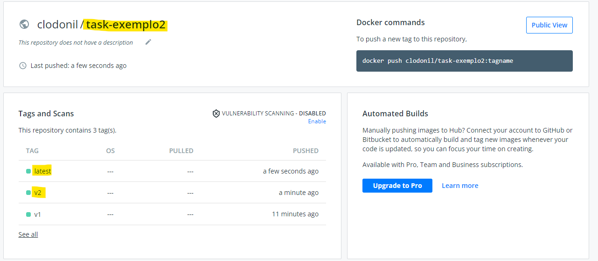

$ kubectl edit configmap feature-flags -n tekton-pipelines
enable-tekton-oci-bundles is set to "true"

 A Tekton Bundleé um artefato OCI que contém recursos Tekton, como os Tasksque podem ser referenciados em um arquivo taskRef.


 O PipelineRunexecutará isso Tasksem registrá-lo no cluster, permitindo que várias versões do mesmo nome Tasksejam executadas de uma só vez.

Tekton Bundlespode ser construído com qualquer conjunto de ferramentas que produza artefatos de imagem OCI válidos, desde que o artefato cumpra o contrato .


A Open Container Initiative (OCI) é um projeto da Linux Foundation para criar padrões abertos para virtualização em nível de sistema operacional, principalmente contêineres Linux. Existem atualmente duas especificações em desenvolvimento e em uso: Runtime Specification (runtime-spec) e Image Specification (image-spec).

Histórias de usuário (opcional)
S Taske Pipelines com versão e Pipeline como código
Esta proposta terá os seguintes benefícios:

O Taskou o Pipelinereferido não precisa estar presente ao se referir a ele, caberia ao controlador a responsabilidade de obter a definição e utilizá-la na memória .
Como eles não estão presentes no cluster, não há risco de substituir um Taskarquivo Run. Ele simplifica um cenário de pipeline como código em que não precisaríamos nos preocupar com uma atualização Taskou Pipelinedefinição de PR para substituir a versão do branch principal .
É mais fácil gerenciar e raciocinar sobre a versão da tarefa. Sem essa proposta, o usuário precisa incluir versões no nome Task/ Pipeline se quiser ter um conceito de versão.

Um bundle é uma imagem OCI que contém 0+ arquivos arbitrários e 0+ referências a imagens OCI dependentes (que também podem ser bundles ). Ao rastrear imagens dependentes, o imgpkg pode copiar pacotes entre registros.

As imagens referenciadas são armazenadas no .imgpkgdiretório no nível raiz da imagem do pacote configurável.

```bash
./bundle-exemplo1.sh
Creating Tekton Bundle:
        - Added Task: task-exemplo1 to image

Pushed Tekton Bundle to index.docker.io/clodonil/task-exemplo1@sha256:d65ab1d53cc856926b742b0c8738bc8cfdf3be83de410936edc451c0b09ecd7c
Creating Tekton Bundle:
        - Added Task: task-exemplo1 to image

Pushed Tekton Bundle to index.docker.io/clodonil/task-exemplo1@sha256:d65ab1d53cc856926b742b0c8738bc8cfdf3be83de410936edc451c0b09ecd7c
Creating Tekton Bundle:
        - Added Task: task-exemplo2 to image

Pushed Tekton Bundle to index.docker.io/clodonil/task-exemplo2@sha256:44c0c3c73c5082452d956d3d069681f73cdd9669274ed4deea804fad0567b118
Creating Tekton Bundle:
        - Added Task: task-exemplo2 to image

Pushed Tekton Bundle to index.docker.io/clodonil/task-exemplo2@sha256:44c0c3c73c5082452d956d3d069681f73cdd9669274ed4deea804fad0567b118
```


```yaml
apiVersion: tekton.dev/v1beta1
kind: TaskRun
metadata:
  name: bundle-task
spec:
  taskRef:
    name: task1
    bundle: index.docker.io/clodonil/task-exemplo1:latest
```

Para executar a task:

```bash
 kubectl apply -f taskrun-bundle-exemplo1.yaml
```


```yaml
apiVersion: tekton.dev/v1beta1
kind: Pipeline
metadata:
  name: pipeline-exemplo1
spec:
  params:
    - name: IMAGE
      description: Nome da imagem
    - name: command
      description: comando para execução
      type: array
  tasks:
    - name: exemplo1
      taskRef:
        name:   task-exemplo1
        bundle: index.docker.io/clodonil/task-exemplo1:latest
    - name: exemplo2
      params:
        - name: buildImage
          value: $(params.IMAGE)
        - name: build-args
          value: 
             - "$(params.command)"
      taskRef:
        name:   task-exemplo2
        bundle: index.docker.io/clodonil/task-exemplo2:latest
```
```bash
kubectl apply -f src/bundle/pipeline-exemplo1.yaml
```
E para executar a pipeline, podemos utilizar o comando `tkn`:

```bash
tkn pipeline start pipeline-exemplo1 -p IMAGE='centos' -p command='ls','-l /' --showlog
```

Subindo a versão 2:

```bash
 ./bundle-push-v2.sh
Creating Tekton Bundle:
        - Added Task: task-exemplo1 to image

Pushed Tekton Bundle to index.docker.io/clodonil/task-exemplo1@sha256:4e0c7866a4c0faf0424f46e1064eda34293030971ad4ce78b6972648ccab6fff
Creating Tekton Bundle:
        - Added Task: task-exemplo1 to image

Pushed Tekton Bundle to index.docker.io/clodonil/task-exemplo1@sha256:4e0c7866a4c0faf0424f46e1064eda34293030971ad4ce78b6972648ccab6fff
Creating Tekton Bundle:
        - Added Task: task-exemplo2 to image

Pushed Tekton Bundle to index.docker.io/clodonil/task-exemplo2@sha256:540f1bbda4c384a3ced27479c993ea021e471b865600aee956d7110de173d4da
Creating Tekton Bundle:
        - Added Task: task-exemplo2 to image

Pushed Tekton Bundle to index.docker.io/clodonil/task-exemplo2@sha256:540f1bbda4c384a3ced27479c993ea021e471b865600aee956d7110de173d4da
```




Para executar a task:

```bash
kubectl delete -f taskrun-bundle-exemplo1.yaml
kubectl apply -f taskrun-bundle-exemplo1.yaml
```


