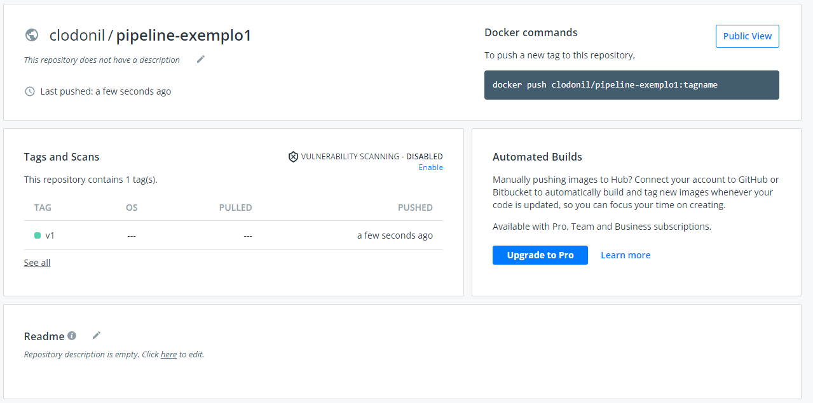

Versionando os templates com Bundles
================
## Objetivo

Ao final deste modulo você será capaz de:
* Entenda o que é bundle
* Como versionar Tasks e Pipelines
* Executando Bundle 
* Criando pipelines com Task Bundle 
* Versionando Pipelines

## Conceito

Tekton Bundle (pacote) é um artefato OCI (`Open Container Initiative`) que contém recursos `Tekton`. Basicamente podemos armazenar `Tasks` e `Pipelines`no formato `yaml` e armazenalas em registry como `dockerhub` ou similares.

No modelo de `Bundle`, podemos referenciar nas `Taskrun` ou `PipelineRun` os artefatos armazenados no registry e os mesmos são abaixados e executados em memória sem a necessidade de armazenamento local.

O conceito do `Bundle`, simplifica um cenário de `pipeline como código` em que não precisamos nos preocupar com uma atualização `Task` ou `Pipeline` diretamente, mais podemos trabalhar com branch e versionamento. É mais fácil gerenciar e raciocinar sobre a versão das `Tasks`. 

A figura abaixo exemplifica a utilização do `Bundle` para gerenciamento de versão de `Pipelines` e `Tasks`. Dessa forma podemos trabalhar com versionamento das pipelines gerando mais controle e governança.


O `PipelineRun` executará às `Task` sem registrá-lo no cluster, permitindo que várias versões do mesmo nome da `Task` sejam executadas de uma só vez. Como as `Tasks`e as `Pipelines` não estão armazenadas no cluster, não há risco de substituir um arquivo da `Task` durante a execução, gerando assim mais segurança.


# Configuração

O Tekton Bundle está atualmente na versão `alpha` e por padrão não vem habilitado. Para habilitar é necessário alterar o configmap `feature-flags` com o recurso `enable-tekton-oci-bundles` para  `true'.

```bash
kubectl edit configmap feature-flags -n tekton-pipelines
```
As linhas que devem ser alterada:

```yaml
apiVersion: v1
data:
  enable-tekton-oci-bundles: "true"
```
# Criando Bundle de exemplo

Antes de criarmos as `Bundle` das pipelines do projeto, vamos criar alguns exemplos para ajudar no entendimento do funcionamento dos `Bundle`.

Para esse exemplo vamos usar o versionamento de duas `Tasks`. Nesse caso vamos utilizar o  [src/bundle/task-exemplo1-v1.yaml](./src/bundle/task-exemplo1-v1.yaml) e o [src/bundle/task-exemplo1-v2.yaml](./src/bundle/task-exemplo1-v2.yaml).

Como essas tasks são apenas um exemplo, a diferença da `task-exemplo1-v1.yaml` para a `task-exemplo1-v2.yaml` é o texto "Execunto Step1 - Versao 1". 

```yaml
apiVersion: tekton.dev/v1beta1
kind: Task
metadata:
  name: task-exemplo1
spec:
  steps:
    - name: step1
      image: ubuntu      
      script: |
        #!/usr/bin/env bash
        echo "Execunto Step1 - Versao 1"
        date
        echo "Finalizado"
```

Da mesma forma temos a [src/bundle/task-exemplo2-v1.yaml](./src/bundle/task-exemplo2-v1.yaml) e a [src/bundle/task-exemplo2-v2.yaml](./src/bundle/task-exemplo2-v2.yaml).

```yaml
apiVersion: tekton.dev/v1beta1
kind: Task
metadata:
  name: task-exemplo2
spec:
  steps:
    - name: step1
      image: ubuntu      
      script: |
        #!/usr/bin/env bash
        echo "Execunto Step1 - Versao 1"
        date
        echo "Finalizado"
```
Agora que temos as `tasks` criadas, podemos subir para o registry utilizando o `tkn`. Para isso acontecer é necessário estar logado no registry. Nesse exemplo, estamos utilizando o dockerhub.

```bash
docker login
Authenticating with existing credentials...
WARNING! Your password will be stored unencrypted in /home/clodo/.docker/config.json.
Configure a credential helper to remove this warning. See
https://docs.docker.com/engine/reference/commandline/login/#credentials-store

Login Succeeded
```

> Não é necessário aplicar as `Tasks` no kubernetes para enviar para os registry.

A sintaxe do `tkn` para o bundle é:

> ``` tkn bundle push <registry>/<artefato> -f <arquivo.yaml> ```

O `tkn bundle` já transforma o arquivo `yaml` no formato OCI e envia para o registry.

Agora vamos subir as tasks para os registry da `docker.io`.

> Altere o nome do repositório do registry, para um que você tenha acesso. Nesse exemplo o nome do repositório é **clodonil** (index.docker.io/**clodonil**/task-exemplo1:v1)

Vamos subir as versões 1 e 2.


```bash
tkn bundle push index.docker.io/clodonil/task-exemplo1:v1 -f src/bundle/task-exemplo1-v1.yaml
tkn bundle push index.docker.io/clodonil/task-exemplo2:v1 -f src/bundle/task-exemplo2-v1.yaml

tkn bundle push index.docker.io/clodonil/task-exemplo1:v2 -f src/bundle/task-exemplo1-v2.yaml
tkn bundle push index.docker.io/clodonil/task-exemplo2:v2 -f src/bundle/task-exemplo2-v2.yaml
```

A sintaxe do comando é bastante simples:

* ***`tkn bundle push`:*** Comando para enviar um artefato (Task ou Pipeline) para o registry;
* ***`index.docker.io/clodonil/task-exemplo2:v2`:*** Define o registry e o path no registry, também define a tag, que neste caso é `v2`; e
* ***`-f src/bundle/task-exemplo2-v2.yaml`:*** É o arquivo `yaml` que será armazenado no registry.

Podemos verificar no `docker.io` que os artefatos foram registrados.


Com as `bundle` armazenadas, podemos utilizar na `TaskRun` referenciando o bundle no `taskRef` conforme o exemplo abaixo [src/bundle/taskrun-bundle-exemplo1.yaml](./src/bundle/taskrun-bundle-exemplo1.yaml).

```yaml
apiVersion: tekton.dev/v1beta1
kind: TaskRun
metadata:
  name: bundle-task-v1
spec:
  taskRef:
    name: task-exemplo1
    bundle: index.docker.io/clodonil/task-exemplo1:v1
```

Para executar a task:

```bash
kubectl apply -f src/bundle/taskrun-bundle-exemplo1.yaml
```
> Você pode alterar a versão da Tasks e executar novamente a `Taskrun` para validar se a versão 2 esta sendo baixada corretamente.
> Você pode também criar uma `Taskrun` para executar a `task-exemplo2:v1`.

Da mesma forma podemos utilizar os `bundle` em uma pipeline, conforme mostrado no exemplo abaixo.

```yaml
apiVersion: tekton.dev/v1beta1
kind: Pipeline
metadata:
  name: pipeline-exemplo1
spec:
  tasks:
    - name: exemplo1
      taskRef:
        name:   task-exemplo1
        bundle: index.docker.io/clodonil/task-exemplo1:v1
    - name: exemplo2
      taskRef:
        name:   task-exemplo2
        bundle: index.docker.io/clodonil/task-exemplo2:v1
```
Com a pipeline criada vamos subir para o `Tekton`:

```bash
kubectl apply -f src/bundle/pipeline-exemplo1-v1.yaml
```
E para executar a pipeline, podemos utilizar o comando `tkn`:

```bash
tkn pipeline start pipeline-exemplo1-v1 --showlog
```

Também podemos subir a `Pipeline` para o registry e versionar. Antes de fazermos isso vamos deletar a `pipeline-exemplo1` criando anteriormente para não gerar confusão. Queremos que o `Tekton` abaixe a pipeline durante a execução e não tenha nenhum template armazenado no cluster.

Deletando a pipeline criado no `Tekton`.

```bash
kubectl delete -f src/bundle/pipeline-exemplo1-v1.yaml
```
Agora que a pipeline foi deletada, vamos subir a pipeline para o registry. O comando é similar o que fizemos alteriormente com as `Tasks`.

```bash
tkn bundle push index.docker.io/clodonil/pipeline-exemplo1:v1 -f src/bundle/pipeline-exemplo1-v1.yaml
```

Podemos verificar no `docker.io` que os artefatos foram registrados.




Agora podemos construir uma `PipelineRun`[src/bundle/pipelinerun-bundle-exemplo1-v1.yaml](./src/bundle/pipelinerun-bundle-exemplo1-v1.yaml) referenciando a pipeline no registry e assim executar a pipeline.

```yaml
apiVersion: tekton.dev/v1beta1
kind: PipelineRun
metadata:
  name: pipelinerun-bundle-exemplo1-v1
spec:
  pipelineRef:
    name: pipeline-exemplo1
    bundle: docker.io/clodonil/pipeline-exemplo1:v1
```

E para executar a pipeline na versão v1:

```bash
kubectl apply -f src/bundle/pipelinerun-bundle-exemplo1-v1.yaml
```

Na figura abaixo podemos verificar a execução da pipeline no `Tekton`.


> Você também pode criar criar a pipeline-exemplo:v2 apontando para as tasks com a versão 2 e testar se esta tudo funcionando corretamete.

# Bundle para o projeto

Agora que entendemos o conceito dos `Bundle` e construimos alguns exemplos, vamos criar para o projeto de `Pipeline` que estamos desenvolvendo.

Como as `Tasks` já estão criadas, vamos apenas subir para o registry. Vamos utilizar as versões como `tags` tais como `v1.0`, `v2.0`. E sempre a ultima versão também receba a tag `latest`.

Dessa forma ao atualizarmos uma `Tasks` todas as execuções de pipeline são atualizadas automaticamente. 

O sintaxe do nome que estamos utilizando é:

* <nome_do_template>_<nome_da_tasks>:tag

Exemplo:
* micrservice-api_source:v1

Vamos para a execução:

```bash
tkn bundle push index.docker.io/clodonil/microservice-api_tasks_source:v1 -f proj/tasks/Source/task-source.yaml
tkn bundle push index.docker.io/clodonil/microservice-api_tasks_source:latest -f proj/tasks/Source/task-source.yaml


tkn bundle push index.docker.io/clodonil/microservice-api_tasks_build:v1 -f proj/tasks/Build/task-build.yaml
tkn bundle push index.docker.io/clodonil/microservice-api_tasks_build:latest -f proj/tasks/Build/task-build.yaml


tkn bundle push index.docker.io/clodonil/microservice-api_tasks_qa:v1 -f proj/tasks/QA/task-qa.yaml
tkn bundle push index.docker.io/clodonil/microservice-api_tasks_qa:latest -f proj/tasks/QA/task-qa.yaml


tkn bundle push index.docker.io/clodonil/microservice-api_tasks_security:v1 -f proj/tasks/Security/task-security.yaml
tkn bundle push index.docker.io/clodonil/microservice-api_tasks_security:latest -f proj/tasks/Security/task-security.yaml


tkn bundle push index.docker.io/clodonil/microservice-api_tasks_tests:v1 -f proj/tasks/Tests/task-tests.yaml
tkn bundle push index.docker.io/clodonil/microservice-api_tasks_tests:latest -f proj/tasks/Tests/task-tests.yaml


tkn bundle push index.docker.io/clodonil/microservice-api_tasks_deploy:v1 -f proj/tasks/Deploy/task-deploy.yaml
tkn bundle push index.docker.io/clodonil/microservice-api_tasks_deploy:latest -f proj/tasks/Deploy/task-deploy.yaml


tkn bundle push index.docker.io/clodonil/microservice-api_tasks_finally:v1 -f proj/tasks/Finally/task-finally.yaml
tkn bundle push index.docker.io/clodonil/microservice-api_tasks_finally:latest -f proj/tasks/Finally/task-finally.yaml
```

Podemos verificar no `docker.io` que os artefatos foram registrados.


Agora também vamos criar a pipeline como `Bundle`. Na pipeline, foi adicionado a referência para o `bundle` de cada tasks, como por exemplo do `Source`. Perceba que estamos apontando para a versão `latest`.

O arquivo [proj/pipeline/microservice-api-bundle.yaml](./proj/pipeline/microservice-api-bundle.yaml) contém o arquivo completo da pipeline modificado para trabalhar com o `Bundle`.


```yaml
  tasks:
    - name: source
      retries: 3
      params:
         - name: revision
           value: $(params.revision)
         - name: url
           value: $(params.url)
      workspaces:
         - name: output
           workspace: source       
      taskRef:
        name: source
        bundle: index.docker.io/clodonil/microservice-api_tasks_source:latest
```

Agora podemos subir a pipeline como bundle.

```bash
tkn bundle push index.docker.io/clodonil/microservice-api_pipeline:v1 -f proj/pipeline/microservice-api-bundle.yaml
```

Antes de executar a pipeline é necessário realizar as seguintes configurações no cluster:

* Criar Workspaces

```bash
kubectl apply -f proj/pv-workspaces.yaml
```

* Desabilitando o Assistente de Afinidade:

Edite o configmap
```yaml
kubectl edit configmap feature-flags -n tekton-pipelines
```
Procure disable-affinity-assistant. Altere seu valor para `true`.

* Atualizar a workspace da sharedlibrary

```bash
kubectl apply -f proj/tasks/Source/taskrun-sharedlibrary-bundle.yaml
```

* Crie o `secret` com o token do SONAR

```bash
kubectl create secret generic sonar --from-literal=SONAR_TOKEN=$TOKEN
```

* Crie o `secret` para autenticação no registry

Altere para os valores do seu acesso no registry.
```bash
kubectl create secret docker-registry myregistrykey \
  --docker-server=$DOCKER_REGISTRY_SERVER \
  --docker-username=$DOCKER_USER \
  --docker-password=$DOCKER_PASSWORD \
  --docker-email=$DOCKER_EMAIL

kubectl patch serviceaccount default -p '{"secrets": [{"name": "myregistrykey"}]}'
```
* Permissão para o Tekton realizar o deploy

```bash
kubectl apply -f proj/tasks/Deploy/sa.yaml
```

Após finalizar a criação dos pré-requisitos, podemos executar a `PipelineRun` do arquivo [proj/pipeline/microservice-api-bundle-run.yaml](./proj/pipeline/microservice-api-bundle-run.yaml).

```yaml
apiVersion: tekton.dev/v1alpha1
kind: PipelineRun
metadata:
  name: pipelinerun-python
spec:
  workspaces:
    - name: sharedlibrary
      persistentVolumeClaim:
         claimName: sharedlibrary
    - name: app-source
      persistentVolumeClaim:
         claimName: app-source
  params:
    - name: IMAGE
      value: "clodonil/apphello:1"
    - name: runtime
      value: python
    - name: revision
      value: master
    - name: url
      value: 'https://github.com/clodonil/apphello.git'
    - name: runtime
      value: 'python'
    - name: appname
      value: 'helloworld'
    - name: registry
      value: clodonil
  pipelineRef:
    name: microservice-api
    bundle: index.docker.io/clodonil/microservice-api_pipeline:v1
```

Para executar o `PipelineRun`:

```bash
 kubectl apply -f proj/pipeline/microservice-api-bundle-run.yaml
```
Podemos acompanhar a execução da pipeline no dashboard do `Tekton`:


Uma proposta de gestão de pipeline, seria o controle atráves de `gitflow`, conforme mostra a figura abaixo.


> Fica como exercício da criação de uma pipeline no `Tekton` para realizar a gestão dos templates e Tasks, conforme o exemplo acima.

