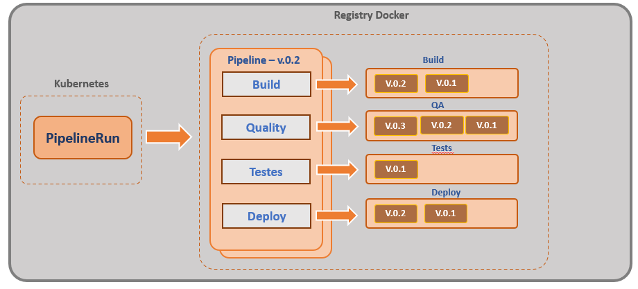

Criando TasksVersionando os templates com Bundles
================
## Objetivo

Ao final deste modulo você será capaz de:
* Entenda o que é uma Task
* Entenda como clonar um projeto git e compilação usando o Task
* Entenda como funciona os Workspaces
* Crie uma task de build 
* Como executar uma Tasks

## Conceito

Tekton Bundle é um artefato OCI (`Open Container Initiative`) que contém recursos `Tekton`. Basicamente podemos armazenar `Tasks` e `Pipelines`no formato `yaml` e armazenalas em registry como `dockerhub` ou similares.

No modelo de `Bundle`, podemos referenciar nas `Taskrun` ou `PipelineRun` os artefatos armazenados no registry e os mesmos são abaixados e executados em memória sem a necessidade de armazenamento local.

O conceito do `Bundle`, simplifica um cenário de `pipeline como código` em que não precisamos nos preocupar com uma atualização `Task` ou `Pipeline` diretamente, mais podemos trabalhar com branch e versionamento.É mais fácil gerenciar e raciocinar sobre a versão das `Tasks`. 

A figura abaixo exemplifica a utilização do `Bundle` para gerenciamento de versão de `Pipelines` e `Tasks`. Dessa forma podemos trabalhar com versionamento das pipelines gerando mais controle de governança.



O `PipelineRun` executará às `Task` sem registrá-lo no cluster, permitindo que várias versões do mesmo nome da `Task` sejam executadas de uma só vez.

Com as `Tasks`e as `Pipelines` não estão armazenadas no cluster, não há risco de substituir um arquivo da `Task` durante a execução, gerando assim mais segurança.


# Configuração

O Tekton Bundle está atualmente na versão `alpha` e por padrão não vem habilitado. Para habilitar é necessário alterar o configmap `feature-flags` com o recurso `enable-tekton-oci-bundles` para  `true'.

```bash
kubectl edit configmap feature-flags -n tekton-pipelines
```
As linhas que devem ser alterada:

```yaml
apiVersion: v1
data:
  enable-tekton-oci-bundles: "true"
```
# Criando Bundle de exemplo

Antes de criarmos as `Bundle` das pipelines do projeto, vamos criar alguns exemplos para ajudar no entendimento do funcionamento dos `Bundle`.

Para esse exemplo vamos usar o versionamento de duas `Tasks`. Nesse caso vamos utilizar o  [src/bundle/task-exemplo1-v1.yaml](.src/bundle/task-exemplo1-v1.yaml) e o [src/bundle/task-exemplo1-v2.yaml](.src/bundle/task-exemplo1-v2.yaml).

Abaixo temos o arquivo `task-exemplo1-v1.yaml` e a `task-exemplo1-v2.yaml`, representando duas versões de `Tasks`. Como é apenas um exemplo, estamos alterando apenas o texto "Execunto Step1 - Versao 1" nas `Tasks`. 

```yaml
apiVersion: tekton.dev/v1beta1
kind: Task
metadata:
  name: task-exemplo1
spec:
  steps:
    - name: step1
      image: ubuntu      
      script: |
        #!/usr/bin/env bash
        echo "Execunto Step1 - Versao 1"
        date
        echo "Finalizado"
```

Da mesma forma temos a [src/bundle/task-exemplo2-v1.yaml](.src/bundle/task-exemplo2-v1.yaml) e a [src/bundle/task-exemplo2-v2.yaml](.src/bundle/task-exemplo2-v2.yaml).

Como é apenas um exemplo, estamos alterando apenas o texto "Execunto Step1 - Versao 1" nas `Tasks`. 

```yaml
apiVersion: tekton.dev/v1beta1
kind: Task
metadata:
  name: task-exemplo2
spec:
  steps:
    - name: step1
      image: ubuntu      
      script: |
        #!/usr/bin/env bash
        echo "Execunto Step1 - Versao 1"
        date
        echo "Finalizado"
```

Agora que temos as `tasks` criadas, podemos subir para o registry utilizando o `tkn`.

> Não é necessário aplicar as `Tasks` no kubernetes para enviar para os registry.

A sintaxe do `tkn` para o bundle é:

> ``` tkn bundle push <registry>/<artefato> -f <arquivo.yaml> ```

O `tkn bundle` já transforma o arquivo `yaml` no formato OCI e envia para o registry.

Agora vamos subir as tasks para os registry da `docker.io`. Vamos subir as versões 1 e 2.


```bash
tkn bundle push index.docker.io/clodonil/task-exemplo1:v1 -f src/bundle/task-exemplo1-v1.yaml
tkn bundle push index.docker.io/clodonil/task-exemplo2:v1 -f src/bundle/task-exemplo2-v1.yaml

tkn bundle push index.docker.io/clodonil/task-exemplo1:v2 -f src/bundle/task-exemplo1-v2.yaml
tkn bundle push index.docker.io/clodonil/task-exemplo2:v2 -f src/bundle/task-exemplo2-v2.yaml
```

A sintaxe do comando é bastante simples:

* ***`tkn bundle push`:*** Comando para enviar um artefato (Task ou Pipeline) para o registry;
* ***`index.docker.io/clodonil/task-exemplo2:v2`:*** Define o registry e o path no registry, também define a tag, que neste caso é `v2`; e
* ***`-f src/bundle/task-exemplo2-v2.yaml`:*** É o arquivo `yaml` que será armazenado no registry.

Podemos verificar no `docker.io` que os artefatos foram registrados.


Com as `bundle` armazenadas, podemos utilizar na `TaskRun` referenciando o bundle no taskRef conforme o exemplo abaixo [src/bundle/taskrun-bundle-exemplo1.yaml](.src/bundle/taskrun-bundle-exemplo1.yaml).

```yaml
apiVersion: tekton.dev/v1beta1
kind: TaskRun
metadata:
  name: bundle-task
spec:
  taskRef:
    name: task1
    bundle: index.docker.io/clodonil/task-exemplo1:latest
```

Para executar a task:

```bash
kubectl apply -f src/bundle/taskrun-bundle-exemplo1.yaml
```

Da mesma forma podemos utilizar os `bundle` em uma pipeline, conforme mostrado no exemplo abaixo.

```yaml
apiVersion: tekton.dev/v1beta1
kind: Pipeline
metadata:
  name: pipeline-exemplo1
spec:
  tasks:
    - name: exemplo1
      taskRef:
        name:   task-exemplo1
        bundle: index.docker.io/clodonil/task-exemplo1:v2
    - name: exemplo2
      taskRef:
        name:   task-exemplo2
        bundle: index.docker.io/clodonil/task-exemplo2:v2
```
Com a pipeline criada vamos subir para o `Tekton`:

```bash
kubectl apply -f src/bundle/pipeline-exemplo1.yaml
```
E para executar a pipeline, podemos utilizar o comando `tkn`:

```bash
tkn pipeline start pipeline-exemplo1 --showlog
```

Também podemos subir a `Pipeline` para o registry e versionar. Antes de fazermos isso vamos deletar a `pipeline-exemplo1` criando anteriormente para não gerar confusão. Queremos que o `Tekton` abaixe a pipeline durante a execução.

Deletando a pipeline criado no `Tekton`.

```bash
kubectl delete -f src/bundle/pipeline-exemplo1.yaml
```
Agora que a pipeline foi deletada, vamos subir a pipeline para o registry. O comando é similar o que fizemos alteriormente com as `Tasks`.

```bash
tkn bundle push index.docker.io/clodonil/pipeline-exemplo1:v1 -f pipeline-exemplo1.yaml
```

Podemos verificar no `docker.io` que os artefatos foram registrados.


Agora podemos construir uma `PipelineRun`(<./src/bundle/pipelinerun-bundle-exemplo1.yaml>) referenciando a pipeline no registry e assim executar a pipeline.

```yaml
apiVersion: tekton.dev/v1beta1
kind: PipelineRun
metadata:
  name: pipelinerun-bundle-exemplo1-run1
spec:
  pipelineRef:
    name: pipeline-exemplo1
    bundle: docker.io/clodonil/pipeline-exemplo1:v1
```
Na figura abaixo podemos verificar a execução da pipeline no `Tekton`.


