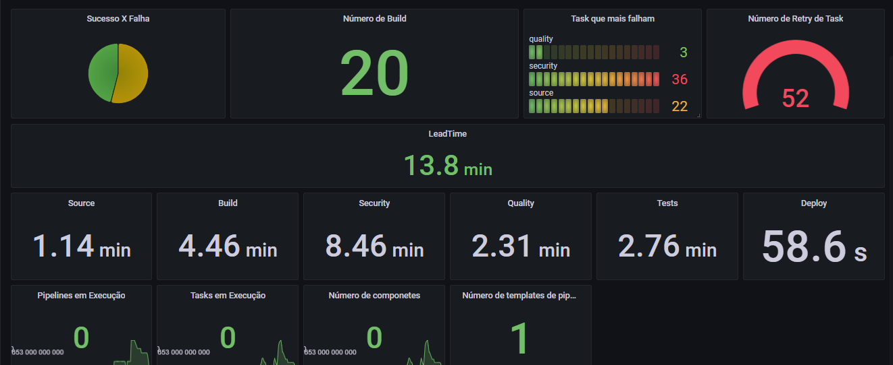
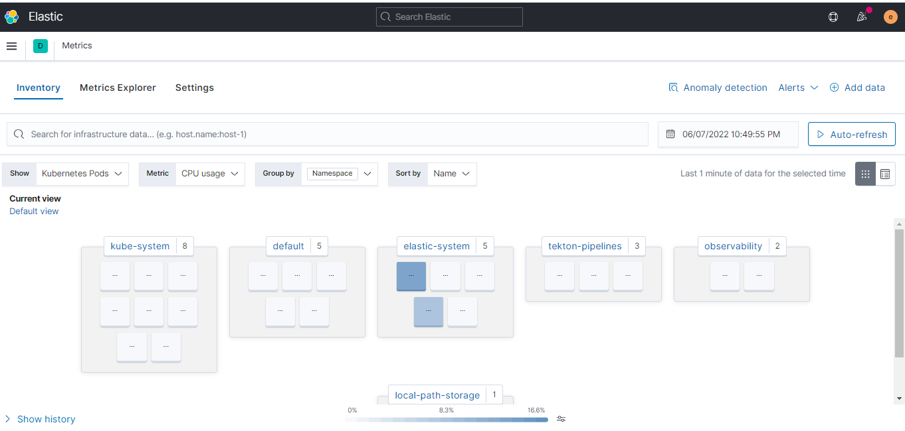

Observability
================
## Objetivo

Ao final deste módulo você será capaz de:
* Criar métricas das pipelines
* Criar métricas de tasks
* Gerenciar os logs 

# Habilitando Métricas no Tekton

Para habilitar as métricas no Tekton é necessário alterar o `configmap`. O Tekton permite externalizar as métricas para o `stackdrier`ou `prometheus`. 

Nesse módulo vamos externalizar as métricas no tekton no formato do  `prometheus`. E para isso vamos instalar o `prometheus` e também o `grafana` para visualizar as métricas. 


O configmap trás como métricas padrão os seguintes valores:


```yaml
    metrics.taskrun.level: "task"
    metrics.taskrun.duration-type: "histogram"
    metrics.pipelinerun.level: "pipeline"
    metrics.pipelinerun.duration-type: "histogram"
```

Segue abaixo os valores possíveis:

|Configuração |	Valor | Descrição|
|------------|--------|----------|
|metrics.taskrun.level |	taskrun|	|
|metrics.taskrun.level |	task	| |
|metrics.taskrun.level |	namespace|	|
|metrics.pipelinerun.level |	pipelinerun	||
|metrics.pipelinerun.level |	pipeline	|  |
|metrics.pipelinerun.level |	namespace	||
|metrics.taskrun.duration-type|	histogram|	|
|metrics.taskrun.duration-type|	lastvalue|	|
|metrics.pipelinerun.duration-type|	histogram|	|
|metrics.pipelinerun.duration-type|	histogram|	|


O [config-observability](./proj/Configs/config-observability.yaml) que estamos utilizando para habilitar as métricas.

```yaml
apiVersion: v1
kind: ConfigMap
metadata:
  name: config-observability
  namespace: tekton-pipelines
  labels:
    app.kubernetes.io/instance: default
    app.kubernetes.io/part-of: tekton-pipelines
data:
    # suporta Stackdriver e prometheus
    metrics.backend-destination: prometheus

    #metrics.stackdriver-project-id: "<your stackdriver project id>"

    metrics.allow-stackdriver-custom-metrics: "false"
    metrics.taskrun.level: "task"
    metrics.taskrun.duration-type: "histogram"
    metrics.pipelinerun.level: "pipeline"
    metrics.pipelinerun.duration-type: "histogram"
```
Para aplicar a configuração no `tekton`:

```bash
kubectl apply -f proj/Configs/config-observability.yaml
```
Para visualizar a externalização das métricas, vamos expor a porta `9090` do `tekton`.

```bash
kubectl port-forward -n tekton-pipelines svc/tekton-pipelines-controller 9090
```
As métricas podem ser acessadas pela url: `http://localhost:9090/metrics`

# Instalação do Prometheus

Agora que `Tekton` externalizou as métricas, vamos precisar instalar o `prometheus` para armazenamento das métricas.

Na configuração do `prometheus` precisamos apontar para o service (`tekton-pipelines-controller.tekton-pipelines.svc:9090`) das métricas do `Tekton`.

O arquivo [prometheus-configmap](./proj/prometheus/prometheus-configmap.yaml) configura o prometheus para buscar os dados no tekton.

```yaml
    global:
      scrape_interval: 5s
      evaluation_interval: 5s
    rule_files:
      - /etc/prometheus/prometheus.rules
    alerting:
      alertmanagers:
      - scheme: http
        static_configs:
        - targets:
          - "tekton-pipelines-controller.tekton-pipelines.svc:9090"
    scrape_configs:
      - job_name: 'media_search'
        scrape_interval: 10s
        static_configs: 
          - targets: ['tekton-pipelines-controller.tekton-pipelines.svc:9090']          
```

Vamos executar o `prometheus` no namespace `observability` e para isso vamos precisar criar a namespace primeiro.
Em seguida vamos realizar o deploy do `prometheus` aplicando os seguintes arquivos:

* [prometheus-deployment.yaml](./proj/Metrics/prometeus/prometheus-deployment.yaml): Deploy do `prometheus` com as configuração da imagem e recursos utilizado 
* [prometheus-services.yaml](./proj/Metrics/prometeus/prometheus-services.yaml): Configuração do service para expor o `prometheus`
* [prometheus-configmap.yaml](./proj/Metrics/prometeus/prometheus-configmap.yaml): Configuração do `prometheus` com o confimap.


Para aplicar a configuração no `prometheus`: 

```bash
kubectl create namespace observability
kubectl -n observability apply -f proj/Metrics/prometeus/
```

O prometheus pode ser acessado pela URL: `http://localhost:30004/`


Tipos de métricas:

| Métrica  |Descrição   |
|----------|------------|
|tekton_go_*       |            |
|tekton_running_{taskruns ou pipelineruns}_count          |            |
|tekton_pipelinerun_count         |            |
|tekton_taskrun_count         |            |
|tekton_{taskrun ou pipelinrun}_duration_seconds_count         |            |
|tekton_{taskrun ou pipelinrun}_duration_seconds_sum         |            |

## Gerando Execuções de Pipelines e Tasks

Agora que temos o `prometheus` configurado, vamos executar algumas pipelines para gerar dados e métricas.

Para isso, temos o script [gerador_de_execucoes](./proj/pipeline/gerador_de_execucoes.sh).  Altere para suas necessidades.

```bash
proj/pipeline/gerador_de_execucoes.sh
```

## Instalação do Grafana

Para visualizar as métricas vamos utilizar o `grafana`. Na configuração é necessário definir o `datasource` que é o `prometheus` e os dasboard que contém os gráficos.  

Para a configuração do datasource vamos utilizar o configmap [grafana-datasource-config.yaml](./proj/Metrics/Grafana/grafana-datasource-config.yaml) e nele apontar para o service do `prometheus`, conforme abaixo.

```yaml
    {
        "apiVersion": 1,
        "datasources": [
            {
               "access":"proxy",
                "editable": true,
                "name": "prometheus",
                "orgId": 1,
                "type": "prometheus",
                "url": "http://prometheus.observability.svc:9090",
                "version": 1
            }
        ]
    }
```
Para implementar o `grafana` vamos aplicar os seguintes arquivo:

* [deployment.yaml](./proj/Metrics/Grafana/deployment.yaml): Arquivo de Deploy que define a imagem do grafana e também as configurações de recursos.
* [services.yaml](./proj/Metrics/Grafana/services.yaml): Configuração do service para expor o `Grafana`
* [grafana-datasource-config.yaml](./proj/Metrics/Grafana/grafana-datasource-config.yaml): Configuração do datasource apontando para o `prometheus`.
* [grafana-dashboards.yaml](./proj/Metrics/Grafana/grafana-dashboards.yaml): Criação do folder do dashboard
* [dashboard-microservice-configmap.yaml](./proj/Metrics/Grafana/dashboard-microservice-configmap.yaml): Criação das métricas das pipelines
* [dashboard-tekton-configmap.yaml](./proj/Metrics/Grafana/dashboard-tekton-configmap.yaml): Criação do dashboard do operator do tekton

Para aplicar a configuração do `grafana`: 

``` 
kubectl -n observability apply -f proj/Metrics/Grafana/
```

O grafana pode ser acessado pela URL: `http://localhost:30003/`



As métricas criadas:

* **Taxa de sucesso e falhas das pipelines**
> tekton_pipelines_controller_pipelinerun_duration_seconds_count{pipeline='microservice-api',status='success'}
> tekton_pipelines_controller_pipelinerun_duration_seconds_count{pipeline='microservice-api',status='failed'}

* **Número de Builds**
> tekton_pipelines_controller_pipelinerun_taskrun_duration_seconds_count{pipeline='microservice-api',status='success',task='build'}

* **As 4 Tasks que mais falham**
> topk(4, tekton_pipelines_controller_pipelinerun_taskrun_duration_seconds_count{status='failed', pipeline='microservice-api'} )

* **Número de retry das tasks**
> sum(count by (pod) (tekton_pipelines_controller_taskruns_pod_latency{pod=~ "microservice-api.*retry.*"}))

* **Lead Time da pipeline**
> tekton_pipelines_controller_pipelinerun_duration_seconds_sum{pipeline='microservice-api',status='success'} / tekton_pipelines_controller_pipelinerun_duration_seconds_count{pipeline='microservice-api',status='success'}

* **Tempo médio de execução de cada tasks**
> tekton_pipelines_controller_pipelinerun_taskrun_duration_seconds_sum{pipeline='microservice-api',status='success',task='build'}/tekton_pipelines_controller_pipelinerun_taskrun_duration_seconds_count{pipeline='microservice-api',status='success',task='build'}

* **Número de pipelines em execução**
> tekton_pipelines_controller_running_pipelineruns_count

* **Número de Tasks em execução**
> tekton_pipelines_controller_running_taskruns_count


## Executando os Logs
O Tekton armazena os logs de execução das TaskRuns e PipelineRuns dentro do `Pod` que contém os contêineres que executam o Steps seu TaskRun ou PipelineRun. 

Você pode obter logs de execução usando um dos seguintes métodos:

Obtenha os nome dos pod das instâncias de Taskrun
```bash
kubectl get taskruns -o yaml | grep 
podName: microservice-api.app5-blgz5-build-pod
podName: microservice-api.app5-blgz5-deploy-pod
podName: microservice-api.app5-blgz5-quality-pod-retry1
podName: microservice-api.app5-blgz5-quality-pod
podName: microservice-api.app5-blgz5-security-pod
podName: microservice-api.app5-blgz5-source-pod
podName: microservice-api.app5-blgz5-tests-pod
```
Também é possível pegar os nome dos Pod das instâncias das pipelinesRun

```bash
kubectl get pipelineruns -o yaml | grep podName
podName: microservice-api.app5-blgz5-build-pod
podName: microservice-api.app5-blgz5-deploy-pod
podName: microservice-api.app5-blgz5-quality-pod-retry1
podName: microservice-api.app5-blgz5-quality-pod
podName: microservice-api.app5-blgz5-security-pod
podName: microservice-api.app5-blgz5-source-pod
podName: microservice-api.app5-blgz5-tests-pod
```
Para visualizar os logs de todos os container do Pod. No exemplo, vamos utilizar o pod `microservice-api.app5-blgz5-build-pod`. 

```bash
kubectl logs microservice-api.app5-blgz5-build-pod --all-containers
```

Uma forma mais simples para visualizar os logs é utilizar o `tkn`. Os logs podem ser visualizados por `Taskrun` especificos ou por execução da `PipelineRun`.

Vamos ver primeiro a  `Taskrun` e para isso primeiro vamos listar todas:

```bash
tkn taskrun list
NAME                                   STARTED       DURATION     STATUS
microservice-api.app5-blgz5-deploy     1 hour ago    10 seconds   Succeeded
microservice-api.app5-blgz5-tests      1 hour ago    27 seconds   Succeeded
microservice-api.app5-blgz5-quality    1 hour ago    45 seconds   Succeeded
microservice-api.app5-blgz5-build      2 hours ago   2 minutes    Succeeded
microservice-api.app5-blgz5-security   2 hours ago   4 minutes    Succeeded
microservice-api.app5-blgz5-source     2 hours ago   16 seconds   Succeeded
taskrun-sharedlibrary                  3 hours ago   24 seconds   Succeeded
```
Agora podemos escolher uma `Taskrun` para visualizar o log.

```bash
tkn taskrun logs microservice-api.app5-blgz5-tests
[performance] + k6 run /workspace/sharedlibrary/TESTS/performance/test.js
[performance]
[performance]           /\      |‾‾| /‾‾/   /‾‾/
[performance]      /\  /  \     |  |/  /   /  /
[performance]     /  \/    \    |     (   /   ‾‾\
[performance]    /          \   |  |\  \ |  (‾)  |
[performance]   / __________ \  |__| \__\ \_____/ .io
[performance]
[performance]   execution: local
[performance]      script: /workspace/sharedlibrary/TESTS/performance/test.js
[performance]      output: -
[performance]
[performance]   scenarios: (100.00%) 1 scenario, 1 max VUs, 10m30s max duration (incl. graceful stop):
[performance]            * default: 1 iterations for each of 1 VUs (maxDuration: 10m0s, gracefulStop: 30s)
[performance]
[performance]
[performance] running (00m01.0s), 1/1 VUs, 0 complete and 0 interrupted iterations
[performance] default   [   0% ] 1 VUs  00m01.0s/10m0s  0/1 iters, 1 per VU
[performance]
[performance] running (00m01.0s), 0/1 VUs, 1 complete and 0 interrupted iterations
[performance] default ✓ [ 100% ] 1 VUs  00m01.0s/10m0s  1/1 iters, 1 per VU
[performance]
[performance]      data_received..............: 0 B     0 B/s
[performance]      data_sent..................: 0 B     0 B/s
[performance]      http_req_blocked...........: avg=0s min=0s med=0s max=0s p(90)=0s p(95)=0s
[performance]      http_req_connecting........: avg=0s min=0s med=0s max=0s p(90)=0s p(95)=0s
[performance]      http_req_duration..........: avg=0s min=0s med=0s max=0s p(90)=0s p(95)=0s
[performance]      http_req_failed............: 100.00% ✓ 1        ✗ 0
[performance]      http_req_receiving.........: avg=0s min=0s med=0s max=0s p(90)=0s p(95)=0s
[performance]      http_req_sending...........: avg=0s min=0s med=0s max=0s p(90)=0s p(95)=0s
[performance]      http_req_tls_handshaking...: avg=0s min=0s med=0s max=0s p(90)=0s p(95)=0s
[performance]      http_req_waiting...........: avg=0s min=0s med=0s max=0s p(90)=0s p(95)=0s
[performance]      http_reqs..................: 1       0.997387/s
[performance]      iteration_duration.........: avg=1s min=1s med=1s max=1s p(90)=1s p(95)=1s
[performance]      iterations.................: 1       0.997387/s
[performance]      vus........................: 1       min=1      max=1
[performance]      vus_max....................: 1       min=1      max=1
```

## Elastic Observability


Para aplicar a configuração do `Elastic`:

```bash
kubectl apply -f https://download.elastic.co/downloads/eck/1.3.1/all-in-one.yaml
kubectl -n elastic-system apply -f monitoring-es-kb.yaml
kubectl -n elastic-system apply -f monitoring-filebeat-metricbeat.yaml
```
Vamos aguardar até todos os serviços estejam rodando.

```bash
kubectl -n elastic-system get pod
NAME                                    READY   STATUS    RESTARTS   AGE
elastic-operator-0                      1/1     Running   0          1h14m
elasticsearch-monitoring-es-default-0   1/1     Running   0          1h11m
filebeat-beat-filebeat-pjsq2            1/1     Running   0          1h7m
kibana-monitoring-kb-ccdd6dfd9-lshnf    1/1     Running   0          1h11m
metricbeat-beat-metricbeat-jh2kr        1/1     Running   0          1h11m
```

User: elastic
password:

```bash
echo $(kubectl get secret -n elastic-system elasticsearch-monitoring-es-elastic-user -o=jsonpath='{.data.elastic}' | base64 --decode)
```

Vamos externalizar o `Elastic` com `port-forward`.

```bash
kubectl port-forward -n elastic-system svc/kibana-monitoring-kb-http 5601
```

https://localhost:5601/app/observability/overview


Você pode filtrar os logs pelo nome da tarefa, nome do TaskRun e assim por diante


Vá para a IU de métricas, na visualização Inventário, e clique em Mostrar os pods do Kubernetes. Em seguida, selecione Agrupado por Namespace. Você deve ver os pods em execução no namespace elastic-system e os que estão sendo executados no namespace tekton-pipelines.



Ao clicar na linha do tempo à direita da tela, você pode acessar o painel "Registrar detalhes do documento do evento" e observar que muitos rótulos Tekton estão disponíveis prontos para uso. Isso porque por padrão o Tekton adiciona rótulos dedicados ao Pod criado para executar a Tarefa, como você pode ver na imagem abaixo:


# Sanitização dos logs

As execuções de `Taskrun` ficam armazenadas no kubernetes e com o uso o número de registro aumenta consideravelmente podendo gerar impacto na performance do kubernetes.

Uma boa prática é limpar os registro com frequência. 

Podemos ver todos os registro do `Taskrun`.

```bash
kubectl get pod
NAME                                             READY   STATUS      RESTARTS   AGE
microservice-api.app1-j9wmg-build-pod            0/3     Completed   0          3m22s
microservice-api.app1-j9wmg-deploy-pod           0/1     Completed   0          45s
microservice-api.app1-j9wmg-quality-pod          0/2     Completed   0          3m22s
microservice-api.app1-j9wmg-security-pod         0/3     Completed   1          3m22s
microservice-api.app1-j9wmg-source-pod           0/1     Completed   0          5m5s
microservice-api.app1-j9wmg-tests-pod            0/3     Completed   1          61s
microservice-api.app2-hxjjh-build-pod            0/3     Completed   0          4m49s
microservice-api.app2-hxjjh-deploy-pod           0/1     Completed   0          109s
microservice-api.app2-hxjjh-quality-pod          0/2     Completed   0          4m48s
microservice-api.app2-hxjjh-security-pod         0/3     Completed   1          4m49s
microservice-api.app2-hxjjh-source-pod           0/1     Completed   0          5m4s
microservice-api.app2-hxjjh-tests-pod            0/3     Completed   1          2m14s
microservice-api.app3-4cnhx-build-pod            0/3     Completed   0          4m45s
microservice-api.app3-4cnhx-deploy-pod           0/1     Completed   0          91s
microservice-api.app3-4cnhx-quality-pod          0/2     Completed   0          4m45s
microservice-api.app3-4cnhx-security-pod         0/3     Completed   1          4m45s
microservice-api.app3-4cnhx-source-pod           0/1     Completed   0          5m3s
microservice-api.app3-4cnhx-tests-pod            0/3     Completed   1          3m8s
microservice-api.app4-ghqcv-build-pod            0/3     Completed   0          3m35s
```
Como os logs estão externalizados no `Elastic`, podemos excluir os registros das `Taskrun` deixando apenas as últimas execuções. 

```bash
tkn pipelinerun delete --keep 2
```