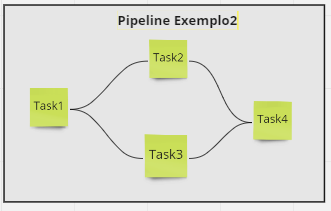
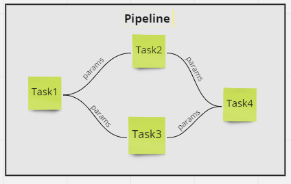
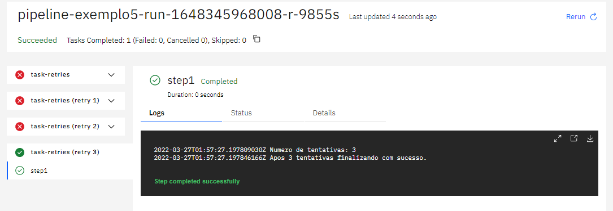
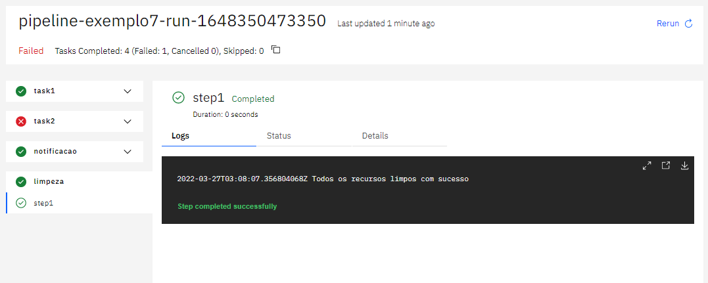

 O que você precisa saber das Pipelines
================

## Objetivo

Ao final deste modulo você será capaz de:
* Entenda como estruturar uma pipeline no Tekton
* Entenda como criar pipelines parametrizável 


## Conceito

No Tekton, uma pipeline é uma coleção de task organizada por ordem específica de execução como parte da entrega de software. As tasks podem ser executadas em paralelo ou sequencial.


### Pipeline e PipelineRun
Enquanto as `Pipeline` define um `template` com o fluxo definido da pipeline, o `PipelineRun` é uma execução de uma `Pipeline`. O histórico de execução e os logs estão registrados no `PipelineRun` para rastreabilidade.


A estrutura básica de criação da `Pipeline` é simples. 

No campo `tasks` são definidos os nome da que será apresentado na pipeline e o `taskref` é o apontamento para uma `Tasks` existente.

Segue um exemplo bem simples.


É importante sempre desenvolver `Pipeline` parametrizável para atender multiplas linguagens e situações.

## Entradas

Como entrada de informação na `Pipeline`, podemos utilizar `parameters` ou `workspaces`.

E durante o desenvolvimento da `Pipeline` temos que definir os parâmetros de entrada. Esse parâmetros podem ser utilizadas de vários formas, como executar ou não uma `Tasks` ou como passagem de parâmentro para uma `Tasks`.

### Parameters

Como entrada de informação vamos começar pelo parâmetro. No exemplo abaixo, temos o primeiro bloco que definir o parâmetro de entrada da pipeline. Portanto ao executar a pipeline é obrigarório a sua declaração.

Esse parâmetro pode ser utilizado como entrada em uma `Tasks` conforme o exemplo do segundo bloco de código.


No arquivo [src/pipeline/pipeline-exemplo1.yaml](./src/pipeline/pipeline-exemplo1.yaml), temos um exemplo funcional da pipeline e como receber o parâmetro e passar para a `Tasks`.

```yaml
apiVersion: tekton.dev/v1beta1
kind: Pipeline
metadata:
  name: pipeline-exemplo1
spec:
  params:
    - name: IMAGE
      description: Nome da imagem
    - name: command
      description: comando para execução
      type: array
  tasks:
    - name: exemplo1
      taskRef:
        name:   task-exemplo1
    - name: exemplo2
      params:
        - name: buildImage
          value: $(params.IMAGE)
        - name: build-args
          value: 
             - "$(params.command)"
      taskRef:
        name:   task-exemplo2
```
Para esse exemplo funcionar, é necessário criar as tasks [src/task-exemplo1.yaml](./src/task-exemplo1.yaml) e [src/task-exemplo2.yaml](./src/task-exemplo2.yaml).

```bash
kubectl apply -f src/task-exemplo1.yaml
kubectl apply -f src/task-exemplo2.yaml
kubectl apply -f src/pipeline-exemplo1.yaml
```
E para executar a pipeline, podemos utilizar o comando `tkn`:

```bash
 tkn pipeline  start pipeline-exemplo1 -p IMAGE='centos' -p command='ls','-l /'
```
Execução da pipeline.


### Workspaces


## Runafter

A configuração de `Runafter` permite criar fluxo de execução em ordem específica na pipeline. Com ele você que uma `Task` só pode ser executada após outra ter finalizado.

No exemplo abaixo, temos uma a task2 e task3 sendo executado após a execução da task1 e a task4 vai começar a execução após a finalização da task 2 e 3.



Um exemplo de código que realiza essa implementação (src/pipeline/pipeline-exemplo2.yaml)[.src/pipeline/pipeline-exemplo2.yaml].

```yaml
apiVersion: tekton.dev/v1beta1
kind: Pipeline
metadata:
  name: pipeline-exemplo1
spec:
  tasks:
    - name: task1
      taskRef:
        name: task1

    - name: task2
      taskRef:
        name: task2
      runAfter:
         - task1    

    - name: task3
      taskRef:
        name: task3
      runAfter:
         - task1    

    - name: task4
      taskRef:
        name: task4
      runAfter:
         - task2
         - task3  
```

Para executar esse exemplo:

```bash
kubectl apply -f src/task-exemplo3.yaml
kubectl apply -f src/pipeline/pipeline-exemplo2.yaml
```

## Params e Result

Durante o fluxo da pipeline é normal uma `Task` precisar utilizar a saída de outra `Task` processada anteriormente. 
A melhor forma de fazer isso é utilizar o recurso `result` de uma `Task` e informar como parâmetro de entrada na `Task` seguinte.




A sintaxe para utilizar o `result` na pipeline é a seguinte:

> $(tasks.<task-name>.results.<result-name>)

No exemplo abaixo temos uma pipeline com controle de fluxo igual ao exemplo anterior, entretanto a saída de um `result` entra como entrada de parâmetro na `Task` seguinte. 

```yaml
apiVersion: tekton.dev/v1beta1
kind: Pipeline
metadata:
  name: pipeline-exemplo1
spec:
  tasks:
    - name: task1
      taskRef:
        name: task1

    - name: task2
      params:
         - name: parametro  
           value: "$(tasks.task1.results.saida)"  
      taskRef:
        name: task2
      
      
    - name: task3
      params:
         - name: parametro  
           value: "$(tasks.task1.results.saida)"  
      taskRef:
        name: task3
      runAfter:
         - task1    

    - name: task4
      params:
         - name: parametro  
           value: "$(tasks.task2.results.saida) $(tasks.task3.results.saida)"  
      taskRef:
        name: task4
      runAfter:
         - task2
         - task3  
```

Para executar esse exemplo:

```bash
kubectl apply -f src/task-exemplo3.yaml
kubectl apply -f src/pipeline/pipeline-exemplo3.yaml
```
## Timeout
Durante a criação da pipeline é possível definir o tempo máximo de execução `timeout`. Esse recurso é interessante para não deixar uma `Tasks` executando infinitamente.

Lembrando que na configuração da `Task` também é possível configurar o `timeout` e aconselhamos deixar a configuração do `timeout` diretamente na `Task`.
Para o recurso de `Custom Tasks` faz todo o sentido a configuração do `timeout` na pipeline.

No exemplo abaixo (src/pipeline/pipeline-exemplo4.yaml)[.src/pipeline/pipeline-exemplo4.yaml] temos uma pipeline com a configuração `timeout`:

```yaml
apiVersion: tekton.dev/v1beta1
kind: Pipeline
metadata:
  name: pipeline-exemplo4
spec:
  tasks:
    - name: task1
      timeout: "1h"
      taskRef:
        name:   task1
    - name: task2
      timeout: "1h"
      taskRef:
        name:   task2
```
Para executar esse exemplo:

```bash
kubectl apply -f src/task-exemplo3.yaml
kubectl apply -f src/pipeline/pipeline-exemplo4.yaml
```

## Retry

O recurso `Retry` você especifica para o `Tekton` quantas vezes deve tentar novamente a execução de uma `Task` em caso de falha.

Esse recurso é interessante para as tasks que podem ter interferência de conexão de rede ou qualquer dependência externa, tais como fazer download de pacotes e libs ou de uma image docker. 

Dentro da `Tasks`, utilizando a variável `$(context.task.retry-count)`, é possível saber quantas `Retry`foram executados e com isso determinar regras de escalonamento de execução.

No próximo exemplo vamos utilizar uma `Task`, (src/task-exemplo9.yaml)[.src/task-exemplo9.yaml] , que verifica quantos `Retry` foram executados e na 3 tentativa é finalizada com sucesso.

```yaml
apiVersion: tekton.dev/v1beta1
kind: Task
metadata:
  name: task-exemplo9
spec:
  steps:
    - name: step1
      image: ubuntu
      script: |
        #!/usr/bin/env bash
        echo "Numero de tentativas: $(context.task.retry-count)"
        if [ "$(context.task.retry-count)" == "3" ]; then
           echo "Apos $(context.task.retry-count) tentativas finalizando com sucesso."
        else
           exit 1   
        fi
```
Já no desenvolvimento da pipeline, (src/pipeline/pipeline-exemplo5.yaml)[.src/pipeline/pipeline-exemplo5.yaml] , é bastante simples, adicionamos o recurso de `retries` e número de tentativas desejadas.

```yaml
apiVersion: tekton.dev/v1beta1
kind: Pipeline
metadata:
  name: pipeline-exemplo5
spec:
  tasks:
    - name: task-retries
      retries: 3
      taskRef:
        name: task-exemplo9
```

Para executar esse exemplo:

```bash
kubectl apply -f src/task-exemplo9.yaml
kubectl apply -f src/pipeline/pipeline-exemplo5.yaml
```
No Dashboard é possível verificar o número de tentativas.



## Result

A Pipelinepode emitir Resultsseus próprios por vários motivos - um sistema externo pode precisar lê-los quando o Pipeline estiver concluído, eles podem resumir os mais importantes Results do Pipeline's Tasks, ou podem simplesmente ser usados ​​para expor mensagens não críticas geradas durante a execução do Pipeline.

A Pipeline's Resultspode ser composto por um ou vários Task Resultsemitidos no decorrer da Pipeline'sexecução. A Pipeline Resultpode se referir ao seu Tasks' Resultsusando uma variável do formato $(tasks.<task-name>.results.<result-name>).

Depois que a Pipelinefor executado, o PipelineRunserá preenchido com o Results emitido pelo Pipeline. Estes serão gravados no PipelineRun's status.pipelineResultscampo.

No exemplo abaixo, o Pipelineespecifica uma resultsentrada com o nome sumque faz referência ao outputValue Resultemitido pelo calculate-sum Task.

```yaml
apiVersion: tekton.dev/v1beta1
kind: Pipeline
metadata:
  name: pipeline-exemplo6
spec:
  tasks:
    - name: task1
      taskRef:
        name: task1
    - name: task2
      taskRef:
        name: task2
    - name: task3
      taskRef:
        name: task3
    - name: task4
      taskRef:
        name: task4
  results:
    - name: task1
      description: resultado da task1
      value: $(tasks.task1.results.saida)
    - name: task2
      description: resultado da task2
      value: $(tasks.task2.results.saida)
    - name: task3
      description: resultado da task3
      value: $(tasks.task3.results.saida)
```
Para executar esse exemplo:

```bash
kubectl apply -f src/task-exemplo3.yaml
kubectl apply -f src/pipeline/pipeline-exemplo6.yaml
```

Para verificar o `Result` da pipeline utilize o `tkn`.  Substitua o `pipeline-exemplo6-run-1648347657260-r-thg5s` pelo id de execução da pipeline.

```bash
tkn pipelinerun  describe pipeline-exemplo6-run-1648347657260-r-thg5s
```


## When

## Finally

O `Tekton` permite adicionar uma lista de `Tasks` ao final da pipeline. Todas as `Tasks` configuradas no `Finally` são executadas em paralelo independente do resultado da pipeline. Portanto mesmo uma pipeline sendo finalizada com falha, as `Tasks` declarada no `Finally` são executadas.

Algumas variáveis interessante para utilizar no `Finally` como entrada de parâmetro para as `Tasks`:

* **$(tasks.task1.status)**: Retorna o status de execução da task1;
* **$(tasks.status)**: Retorna o status de execução de todas as tasks;
* **$(tasks.task1.results.saida)**: Utiliza o `result` da task1;

Os recursos de parâmetros e workspace também estão disponíveis no `Finally`.


```yaml
apiVersion: tekton.dev/v1beta1
kind: Pipeline
metadata:
  name: pipeline-exemplo7
spec:
  tasks:
    - name: task1
      taskRef:
        name: task1
    - name: task2
      params:
        - name: parametro
          value: erro
      taskRef:
        name: task2
  finally:
    - name: notificacao
      params:
         - name: status-task1
           value: "$(tasks.task1.status)"
         - name: status-all
           value: "$(tasks.status)"
      taskRef:
        name: notificacao
    - name: limpeza
      taskRef:
        name: limpeza


```
Para executar esse exemplo:

```bash
kubectl apply -f src/task-exemplo3.yaml
kubectl apply -f src/pipeline/pipeline-exemplo7.yaml
```

No Dashboard é possível verificar a execução do `finally`.



## Custom Tasks

Até agora vimos um padrão da pipeline chamar uma `Tasks` que executa um pod no kubernetes para execução de uma série de comandos. Sabemos que esse modelo atende muitos casos de uso, entretanto tem muitos outros que não necessita da execução de um pod ou a execução de um pod não é adquado.

Por exemplo, imagine uma execução de um `Tasks` que envolve aprovação de uma GMUD. Essa aprovação pode acontecer em 1 minuto ou pode levar dias. Não faz sentido deixar um pod executando todo esse tempo.

Para esses casos que a execução de um pod não faz sentido, podemos utilizar o `Custom Tasks`.
