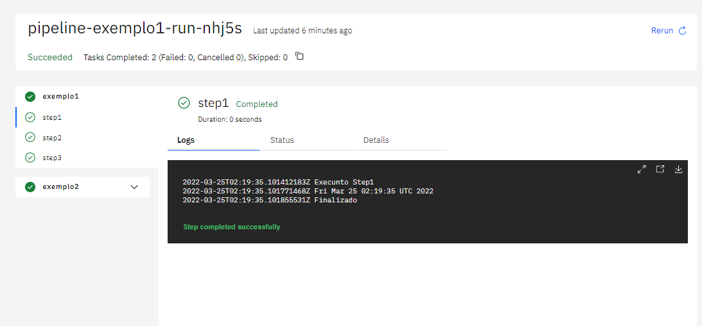

Criando Pipelines
================
## Objetivo

Ao final deste modulo você será capaz de:
* Entenda como estruturar uma pipeline no Tekton
* Entenda como criar pipelines parametrizável 


## Conceito

No Tekton, uma pipeline é uma coleção de task organizada por ordem específica de execução como parte da entrega de software. As tasks podem ser executadas em paralelo ou sequencial.


### Pipeline e PipelineRun
Enquanto as `Pipeline` define um `template` com o fluxo definido da pipeline, o `PipelineRun` é uma execução de uma `Pipeline`. O histórico de execução e os logs estão registrados no `PipelineRun` para rastreabilidade.


A estrutura básica de criação da `Pipeline` é simples. 

No campo `tasks` são definidos os nome da que será apresentado na pipeline e o `taskref` é o apontamento para uma `Tasks` existente.

Segue um exemplo bem simples.


É importante sempre desenvolver `Pipeline` parametrizável para atender multiplas linguagens e situações.

## Entradas

Como entrada de informação na `Pipeline`, podemos utilizar `parameters` ou `workspaces`.

E durante o desenvolvimento da `Pipeline` temos que definir os parâmetros de entrada. Esse parâmetros podem ser utilizadas de vários formas, como executar ou não uma `Tasks` ou como passagem de parâmentro para uma `Tasks`.

### Parameters

Como entrada de informação vamos começar pelo parâmetro. No exemplo abaixo, temos o primeiro bloco que definir o parâmetro de entrada da pipeline. Portanto ao executar a pipeline é obrigarório a sua declaração.

Esse parâmetro pode ser utilizado como entrada em uma `Tasks` conforme o exemplo do segundo bloco de código.


No arquivo (src/pipeline1.yaml)[src/pipeline-exemplo1.yaml], temos um exemplo funcional da pipeline e como receber o parâmetro e passar para a `Tasks`.

```yaml
apiVersion: tekton.dev/v1beta1
kind: Pipeline
metadata:
  name: pipeline-exemplo1
spec:
  params:
    - name: IMAGE
      description: Nome da imagem
    - name: command
      description: comando para execução
      type: array
  tasks:
    - name: exemplo1
      taskRef:
        name:   task-exemplo1
    - name: exemplo2
      params:
        - name: buildImage
          value: $(params.IMAGE)
        - name: build-args
          value: 
             - "$(params.command)"
      taskRef:
        name:   task-exemplo2
```
Para esse exemplo funcionar, é necessário criar as tasks [src/task-exemplo1](./src/task-exemplo1) e [src/task-exemplo2](./src/task-exemplo2.).

```bash
kubectl apply -f src/task-exemplo1.yaml
kubectl apply -f src/task-exemplo2.yaml
kubectl apply -f src/pipeline-exemplo1.yaml
```
E para executar a pipeline, podemos utilizar o comando `tkn`:

```bash
 tkn pipeline  start pipeline-exemplo1 -p IMAGE='centos' -p command='ls','-l /'
```
Execução da pipeline.



### Workspaces
### From


## Runafter
## Timeout
## Retry
## Volumes
## Custom Tasks
## Finally

