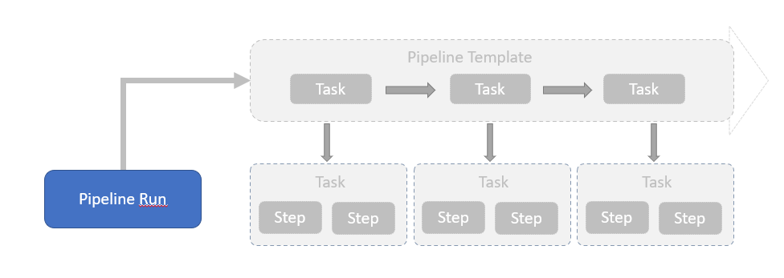
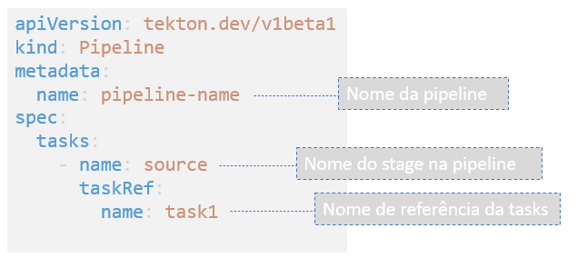
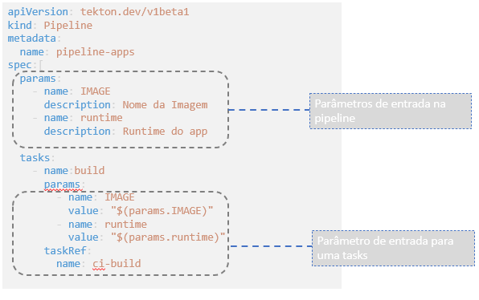

Criando Pipelines
================
## Objetivo

Ao final deste modulo você será capaz de:
* Entenda o que é uma Task
* Entenda como clonar um projeto git e compilação usando o Task
* Entenda como funciona os Workspaces
* Crie uma task de build 
* Como executar uma Tasks

## Conceito

A `Task` é uma coleção de `Steps` que são organizados em ordem de execução como parte de pipeline de `integração continua`. A `Task` é executado da mesma forma que um pod no cluster do Kubernetes, onde cada `Step` se torna um contêiner em execução do pod.

Os `Steps` são executados sequencialmente conforme foram criados e cada um deles pode conter uma imagem de pod diferente. Basicamente um `step` deve receber uma entrada, processar algo especifico e gerar um saída.

### Pipeline e PipelineRun
Enquanto as `Task` define um `template` de execução de tarefas e passos, o `TaskRun` é uma execução de uma `Tasks`. O histórico de execução e os logs estão registrados no `TaskRun` para rastreabilidade.

Dessa forma uma `Task` pode ser generica suficiente para executar a mesma tarefa para diferentes linguagens com regras de execução e históricos de execução individualizada para cada `TaskRun`.

## Entradas
### Parameters

### Workspaces
### From

## Runafter
## Timeout
## Retry
## Volumes
## Custom Tasks
## Finally

