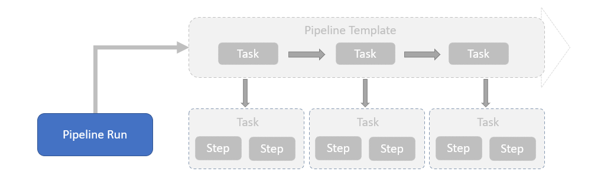

Criando Pipelines
================
## Objetivo

Ao final deste modulo você será capaz de:
* Entenda como estruturar uma pipeline no Tekton
* Entenda como criar pipelines parametrizável 

## Conceito

No Tekton, uma pipeline é uma coleção de task organizada por ordem específica de execução como parte da entrega de software. As tasks podem ser executadas em paralelo ou sequencial.

### Pipeline e PipelineRun
Enquanto as `Pipeline` define um `template` com o fluxo definido da pipeline, o `PipelineRun` é uma execução de uma `Pipeline`. O histórico de execução e os logs estão registrados no `PipelineRun` para rastreabilidade.

Dessa forma uma `Task` pode ser generica suficiente para executar a mesma tarefa para diferentes linguagens com regras de execução e históricos de execução individualizada para cada `TaskRun`.

## Entradas
### Parameters

### Workspaces
### From

## Runafter
## Timeout
## Retry
## Volumes
## Custom Tasks
## Finally

