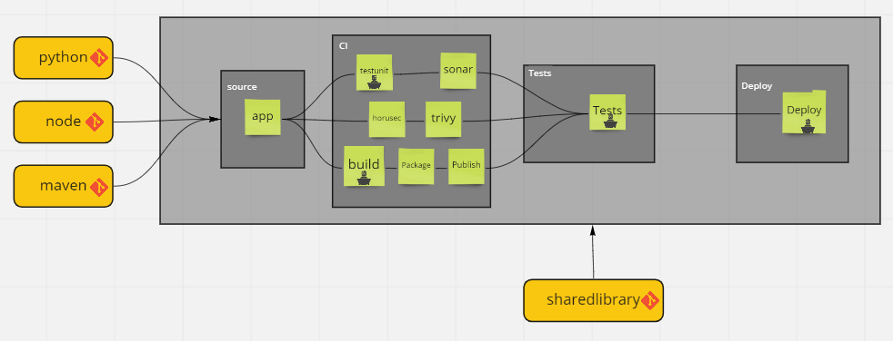

# Proposta do Projeto 

## Objetivo

Apresentar a proposta de desenvolvimento da pipeline utilizando a tecnologia `TekTon`.

## Pipeline de deploy API

A proposta é criar uma pipeline utilizando `TekTon` para publicação de APIs que tenha  `Segurança`, `Qualidade` e `Governança`.

A pipeline deve ter as seguintes caracteristicas:

* Desenvolvimento em Template; 
* SharedLibrary exterminalizado para fácil manutenção;
* Controle de versão dos templates;
* Possibilidade de build/testes e deploy customizado

## Stages Customizados

A pipeline deve ter os comandos padrões de build, tests e deploy. Entretanto caso o desenvolver desejar ele pode sobrescrever esses comandos, através de um arquivo simples no seu repositório:

|stages| Repositório App |[SharedLibrary](https://github.com/clodonil/tekton-sharedlibrary)|
|-------|------|-------------|
|`build` | pipeline/build.sh |/CI/`runtime`/build/build.sh|
| `unittest` |pipeline/unittest.sh | /CI/`runtime`/tests/unittest.sh |
| `performace` | pipeline/tests/performance/performance.sh  | TESTS/performance/performance.sh  |
| `integration`| pipeline/tests/integration/integration.sh  | TESTS/integration/integration.sh |
| `deploy`|pipeline/deploy.sh | /CD/deploy.sh |

## APIs

Segue o link das aplicações que será utilizada para build durante o desenvolvimento da pipeline.

* [Hello World - Python]()
* [Hello World - Node]()
* [Hello World - Goland]()
* [Hello World - Maven]()

