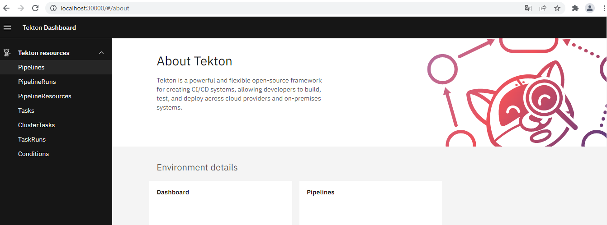

# Setup 

## Objetivo
Ao final desse módulo você deve ter o ambiente preparado e com o `tekton` instalado juntamente com as ferramentas.


## Clone do projeto

Para execução desse módulo, é necessário clonar o repositório do treinamento e configurar a variável de ambiente, caso ainda não tenha feito.

```bash
git clone https://github.com/clodonil/treinamento_tekton_pipelines.git
export TREINAMENTO_HOME="$(pwd)/treinamento_tekton_pipelines"
cd $TREINAMENTO_HOME
```

## Conteúdo:
> 1. Pré-requisitos
> 2. Kubernetes
> 3. Criando o cluster
> 4. Instalação do Tekton
> 5. Instalação de tools
> 6. Automatizando a criação do cluster e instalação do kubernetes

## 1. Pré-requisito

Para realização desse treinamento é necessário que você tenha um computador com `docker` instalado e de preferência com o sistema operacional `Linux`. Se precisar de ajuda para instalar o `docker` utilize essa [documentação](https://docs.docker.com/desktop/).  
Para validar se esta tudo certo com a sua instalação do `docker` execute o seguinte comando:

```bash
docker run hello-world

Hello from Docker!
This message shows that your installation appears to be working correctly.

To generate this message, Docker took the following steps:
 1. The Docker client contacted the Docker daemon.
 2. The Docker daemon pulled the "hello-world" image from the Docker Hub.
    (amd64)
 3. The Docker daemon created a new container from that image which runs the
    executable that produces the output you are currently reading.
 4. The Docker daemon streamed that output to the Docker client, which sent it
    to your terminal.

To try something more ambitious, you can run an Ubuntu container with:
 $ docker run -it ubuntu bash

Share images, automate workflows, and more with a free Docker ID:
 https://hub.docker.com/

For more examples and ideas, visit:
 https://docs.docker.com/get-started/
```
## 2. Kubernetes

O `tekton` é executado no cluster `kubernetes`. Portanto vamos precisamos instânciar um cluster para o treinamento e podemos fazer isso de várias formas. Nesse treinamento vamos utilizar o [kind](https://kind.sigs.k8s.io/).  

Para utilizar o `kind` é bastante simples. 

Esses comandos instala o `kind` no linux.

```bash
curl -Lo ./kind https://kind.sigs.k8s.io/dl/v0.20.0/kind-linux-amd64
chmod +x ./kind
sudo mv ./kind /usr/local/bin/kind
```

Além do `kind` vamos precisar do `kubectl` para manipular o cluster.

Esses comandos instala o `kubectl` no linux.

```linux
curl -LO "https://dl.k8s.io/release/$(curl -L -s https://dl.k8s.io/release/stable.txt)/bin/linux/amd64/kubectl"
chmod +x ./kubectl
sudo mv ./kubectl /usr/local/bin/kubectl
```

### 3. Criando o cluster

Agora que temos o `kind` e o `kubectl` instalado, estamos preparado para criar o cluster de `kubernetes`. Como vamos utilizar o dashboard do `tekton` exposto na porta `30000`, vamos criar o arquivo [`tekton-cluster.conf`](create_server_k8s/tekton-cluster.conf) com todas as informações necessárias, conforme abaixo.


```yaml:create_server_k8s/tekton-cluster.conf
kind: Cluster
apiVersion: kind.x-k8s.io/v1alpha4
name: tekton
nodes:
- role: control-plane
  extraPortMappings:
  - containerPort: 30000
    hostPort: 30000
    listenAddress: "0.0.0.0"
    protocol: TCP
```
Execute o comando abaixo para criação do cluster.

```bash
kind create cluster --config $TREINAMENTO_HOME/create_server_k8s/tekton-cluster.conf
Creating cluster "tekton" ...
 ✓ Ensuring node image (kindest/node:v1.27.3) 🖼
    ✓ Preparing nodes 📦
 ✓ Writing configuration 📜
 ✓ Starting control-plane 🕹️
 ✓ Installing CNI 🔌
 ✓ Installing StorageClass 💾
Set kubectl context to "kind-tekton"
You can now use your cluster with:

kubectl cluster-info --context kind-tekton

Thanks for using kind! 😊
```


### 4. Instalação do Tekton

Agora temos o cluster `kubernetes` instalado e integrado ao comando `kubectl` e assim podemos instalar os CDRs que compoem o `tekton`.

O camando abaixo instala o motor do `tekton` e também o dashboard para visualizar as pipelines.

```bash
kubectl apply --filename https://storage.googleapis.com/tekton-releases/pipeline/latest/release.yaml
kubectl apply --filename https://storage.googleapis.com/tekton-releases/dashboard/latest/release.yaml
```
Podemos acompanhar se os pods do `tekton` estão rodando e prontos.

```bash
kubectl -n tekton-pipelines get pods
NAME                                           READY   STATUS    RESTARTS   AGE
tekton-dashboard-b6c655bd9-bhc8z               1/1     Running   0          13s
tekton-events-controller-79d6f7bdf5-6wz8q      1/1     Running   0          2m18s
tekton-pipelines-controller-5bfc89c554-lckp4   1/1     Running   0          2m18s
tekton-pipelines-webhook-56f8b9f44b-5lfcb      1/1     Running   0          2m18s
```

Certifique que o `tekton` está instalado e as API estão disponível para uso:

```bash
kubectl api-resources --api-group='tekton.dev'
NAME                   SHORTNAMES   APIVERSION            NAMESPACED   KIND
clustertasks                        tekton.dev/v1beta1    false        ClusterTask
customruns                          tekton.dev/v1beta1    true         CustomRun
pipelineruns           pr,prs       tekton.dev/v1         true         PipelineRun
pipelines                           tekton.dev/v1         true         Pipeline
stepactions                         tekton.dev/v1alpha1   true         StepAction
taskruns               tr,trs       tekton.dev/v1         true         TaskRun
tasks                               tekton.dev/v1         true         Task
verificationpolicies                tekton.dev/v1alpha1   true         VerificationPolicy
```

E para finalizar vamos remover o `service` do dashboard que está no modelo de `ClusterIP` e criar um novo do tipo `NodePort`.

```bash
kubectl -n tekton-pipelines delete service tekton-dashboard
kubectl -n tekton-pipelines create service nodeport tekton-dashboard --tcp=9097:9097 --node-port=30000
```

Dashboard deve estar acessível no endereço: `localhost:30000`:



### 5. Instalação de tools
Também vamos precisar de algumas ferramentas durante o workshop.

# Tekton CLI
O tekton CLI é uma ferramenta de linha de comando para interagir com o `tekton` resources.

Faça download do `tekton` cli e adicione no seu path:

```bash
curl -LO https://github.com/tektoncd/cli/releases/download/v0.33.0/tkn_0.33.0_Linux_x86_64.tar.gz
sudo tar xvzf tkn_0.33.0_Linux_x86_64.tar.gz -C /usr/local/bin tkn
```

# Verificando o Tekton cli

Vamos verificar se o `tkn` esta instalado e funcionando.

```
tkn version
Client version: 0.33.0
Pipeline version: v0.55.0
Dashboard version: v0.42.0
```

### 6. Automatizando a criação do cluster e instalação do kubernetes

No diretório `create_server_k8s` disponibilizamos o script [install_tekton.sh](create_server_k8s/install_tekton.sh) que instala o kubernetes e também o `tekton` com todas as configurações realizadas. Vamos precisar fazer isso todas as vezes que precisar limpar todas as configurações.

```bash
$TREINAMENTO_HOME/create_server_k8s/install_tekton.sh
Cluster tekton já existe, deleta (y/n)?
y
Deletando o kubernetes
Instalando o kubernetes
Instalando o Tekton
Iniciando o TekTon.....Done.
Dashboard: http://localhost:30000
tekton Configurado.
```