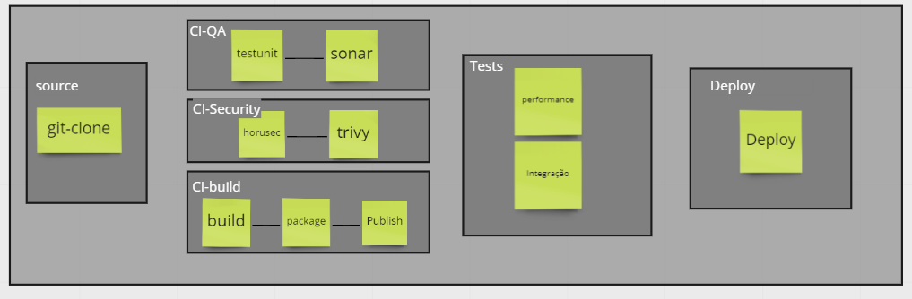
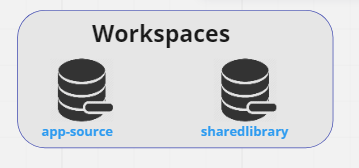
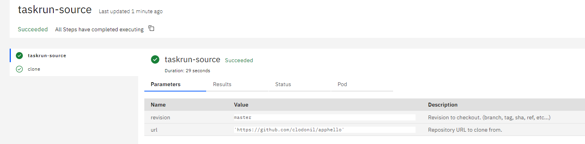
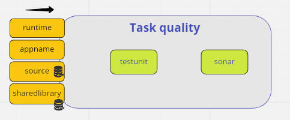
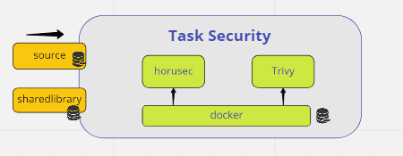
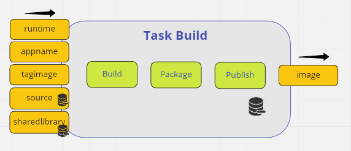
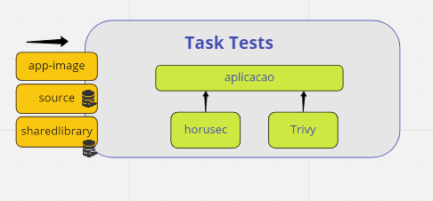
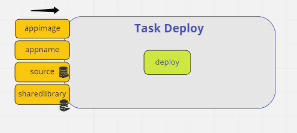

Desenvolvendo as Tasks
================
## Objetivo

Ao final deste modulo você será capaz de:
* Ter criado as tasks necessárias da pipeline;
* Ter validado cada tasks e seus passos;
* Ter utilizado a sharedlibrary;

## Clone do projeto

Para execução desse módulo, é necessário clonar o repositório do treinamento e configurar a variável de ambiente, caso ainda não tenha feito.

```bash
git clone https://github.com/clodonil/treinamento_tekton_pipelines.git
export TREINAMENTO_HOME="$(pwd)/treinamento_tekton_pipelines"
cd $TREINAMENTO_HOME
```

## Conteúdo:
> 1. Conceito
> 2. Tasks e Step
> 3. Parâmetros
> 4. StepTemplate
> 5. Timeout
> 6. Volumes
> 7. Workspaces
> 8. Sidecars
> 9. Results
> 10. onError


## 1. Criando a tasks do Projeto

Para o desenvolvimento do nosso projeto vamos precisar criar **6** `Tasks`:



* `Source`: Essa Task vai ter um `Step`, que basicamente vai fazer o clone do projeto do git;
* `Quality` : Essa Task vai ter 2 `steps`:
    * `TestUnit` : Executa o teste unitario;
    * `Sonar`: Executa a cobertura de qualidade do código;
* `Security`: Essa Task vai ter 2 `steps`:
    * `Horusec`: Ferramenta de Sast para verificar a segurança do código;
    * `Trivy`: Ferramenta para analisar a segurança do container;
* `Build`: Essa Task vai ter 3 `steps`:
    * `Build`: Realiza o build da aplicação.
    * `Package`: Faz o empacotamento da aplicação em uma imagem docker, gerando o artefato final;
    * `Publish`: Pública a imagem no dockerhub;
* `Tests`: Essa Task vai ter 2 `steps`:
    * `Performance`: Teste de performance da aplicação utilizando o `K6`.
    * `Integration`: Teste de API com o Karate
* `Deploy`: Essa Task vai ter apenas um `steps` para realização do deploy simples do container no cluster kubernetes.


## 2. Ferramentas

Nas Tasks vamos utilizar as seguintes ferramentas:

* [SonarCloud](https://sonarcloud.io/): Sonar para analise de qualidade. 
* [horusec](https://horusec.io/site/): Ferramanta de SAST para verificação de segurança do código fonte.
* [trivy](https://www.aquasec.com/products/trivy/): Ferramenta de segurança de container.
* [k6](https://k6.io/): Ferramenta de teste de performance.
* [Karate](https://github.com/karatelabs/karate): Ferramenta de teste de integração de API


## Workspace

Para desenvolvimento da pipeline vamos precisar de **2** `workspace`:

`

* app-source: Nesse workspace vai armazenar o código fonte durante a execução;
* sharedlibrary: Nesse workspace vai conter os comandos necessários para execução das tasks;

Os manifesto dos volumes foram criados no arquivo [proj/pv-workspaces.yaml](proj/pv-workspaces.yaml).

```bash:proj/pv-workspaces.yaml
kubectl apply -f pv-workspaces.yaml
persistentvolumeclaim/app-source created
persistentvolumeclaim/sharedlibrary created
```

## 3 Tasks
O nosso próximo passo vamos criar as `Tasks` necessario para o desenvolvimento da pipeline.

### 3.1 Criando a Tasks `Source`

A Task `Source` vai ser responsável por realizar o clone do projeto do git. Podemos criar essa Task manualmente, entretanto o Tekton disponibiliza o [Tekton-Hub](https://hub.tekton.dev/) que já possui um catalago de Tasks disponibilizada pela comunidade.

E para realisar o clone do projeto, vamos utilizar a Task [git-clone](https://hub.tekton.dev/tekton/task/git-clone) disponibilizado no Tekton-Hub.

Para instalar essa Task, podemos utilizar o CLI:

```
tkn hub install task git-clone
```
Ou podemos utilizar o `kubectl` passando o endereço do git-clone.

```
kubectl apply -f https://raw.githubusercontent.com/tektoncd/catalog/main/task/git-clone/0.5/git-clone.yaml
```
Em seguida devemos aplicar o taskrun-source.yaml

```
kubectl apply -f taskrun-source.yaml
```

Ambos tem o mesmo resultado.

Com  Task instalada, vamos criar a `Taskrun` para realizar o clone do repositório do projeto. 

```yaml:proj/Source/taskrun-source.yaml
apiVersion: tekton.dev/v1alpha1
kind: TaskRun
metadata:
  name: taskrun-source
spec:
  workspaces:
    - name: output
      persistentVolumeClaim:
         claimName: app-source
  params:
    - name: revision
      value: master
    - name: url
      value: 'https://github.com/clodonil/apphello'
  taskRef:
     name: git-clone
```
Podemos acompanhar a execução da Taskrun no dashboard do Tekton ou via CLi (tkn).

`


#### 3.1.1 SharedLibary

A SharedLibary é um repositório que contém os comandos que são executados na pipelines, tornando a solução de pipeline com mais segurança e governança.

A cada alteração no repositório da sharedlibrary no git, é necessário atualizar o `workspace` para a pipelines obter os novos comandos. Para esse controle, o ideal é ter um pipeline apenas para gerenciar a sharedlibrary.

Para esse projeto, vamos criar apenas uma `TaskRun` para atualizar o `workspace`.


```yaml:proj/tasks/Source/task-sharedlibrary.yaml
apiVersion: tekton.dev/v1alpha1
kind: TaskRun
metadata:
  name: taskrun-sharedlibrary
spec:
  workspaces:
    - name: output
      persistentVolumeClaim:
         claimName: sharedlibrary
  params:
    - name: revision
      value: main
    - name: url
      value: 'https://github.com/clodonil/tekton-sharedlibrary'
  taskRef:
     name: git-clone
```

Para fazer o download/atualização da `sharedlibrary` para o workspace precisamos executar a Taskrun. Esse processo deve ser feito toda vez que tiver alteração na `sharedlibrary`.

```bash
kubectl apply -f taskrun-sharedlibrary.yaml
```

### 3.2 Criando a Tasks `Quality`

A próxima Task que vamos criar é a `quality`, que está relacionada a qualidade do código.

A Task tem como entrada:
* `runtime`: Parâmetro que contém a tecnologia utilizada na aplicação
* `appname`: Parâmetro que contém o nome da aplicação
* `source`: Workspace que contém o código fonte da aplicação
* `sharedlibrary`: Workspace que contém os comandos para serem executados na pipeline.

Teremos **2** `steps`:
   * `TestUnit` : Executa o teste unitário;
   * `Sonar`: Executa a cobertura de qualidade do código;



Agora que entendemos a estrutura das Tasks de qualidade, vamos entender como podemos desenvolver.

Primeiramente vamos definir as entradas, conforme o diagrama, seguindo o padrão do `yaml`. 

> Importante, na definição do workspace da sharedlibrary, o mesmo deve ser disponibilizado apenas como leitura (readonly), por questão de segurança da pipeline.

```python
params:
  - name: appname
    description: Nome da Imagem
  - name: runtime
    description: Runtime da aplicacao           
workspaces:
  - name: sharedlibrary
    description: Pasta com os comandos de execucao da pipeline
    readOnly: true                
  - name: source
    description: Pasta com os fontes da aplicacao
```
Antes de criar os `steps`, vamos criar o Steptemplate. Isso é importante para não ficar duplicando linha de código no arquivo e caso seja necessário alterar, podemos fazer isso em um único local.
O template define o diretório de trabalho (`workingdir`), como sendo o diretório do código fonte, e também um volume que vai ser montando em todas os `steps` no diretório /coverage.
Esse volume é do tipo `emptyDir` e vai ser utilizado para a tasks de testunit enviar o reporte de cobertura para o step do sonar.

```python
stepTemplate:
  workingDir: /workspace/source
  volumeMounts:
    - name: coverage
      mountPath: /coverage
volumes:
  - name: coverage
    emptyDir: {}    
```
Agora vamos definir os `steps`. 

O primeiro step é o teste unitário. A imagem utilizada no step é definida no parâmetro `runtime`. Esse step pode ser customizado pelo desenvolver.

```bash
[ -f "pipeline/unittest.sh" ] && sh pipeline/unittest.sh || sh $(workspaces.sharedlibrary.path)/CI$runtime/tests/unittest.sh 
```
Essa linha verifica se o arquivo `pipeline/unittest.sh` existe no repositório e executa. Caso contrato executa o script que esta no sharedlibrary.  

```python
- name: unit-testing
  image: $(params.runtime)
  script: |
    runtime=$(params.runtime)               
    [ -f "pipeline/unittest.sh" ] && sh pipeline/unittest.sh || sh $(workspaces.sharedlibrary.path)/CI$runtime/tests/unittest.sh 
```
O segundo step é o sonar para analise de qualidade do código. Para isso vamos utilizar o site [SonarCloud](https://sonarcloud.io/).

É necessário criar uma conta no site e um projeto 

```python   
    - name: sonar
      env:
        - name: SONAR_TOKEN
          valueFrom:
            secretKeyRef:
              name: sonar
              key: SONAR_TOKEN
      image: ubuntu
      script: |
        sh $(workspaces.sharedlibrary.path)/CI/$(params.runtime)/sonar/sonar.sh
```

Crie um secret para armazenar o Token criado no site [SonarCloud](https://sonarcloud.io/).

```bash
kubectl create secret generic sonar --from-literal=SONAR_TOKEN=$TOKEN
```    

* [Link do Task de QA](proj/tasks/QA/task-qa.yaml)
* [Link do Taskrun de QA](proj/tasks/QA/taskrun-qa.yaml)

### 3.3 Criando a Tasks `Security`

A próxima Task que vamos criar é a `Security`, que está relacionada a segurança do código e do container.

A Task tem como entrada:
* `source`: Workspace que contém o código fonte da aplicação
* `sharedlibrary`: Workspace que contém os comandos para serem executados na pipeline.

Teremos **2** `steps`:
   * `horusec` : Executa o teste unitário;
   * `trivy`: Executa a cobertura de qualidade do código;

Nessa Task a solução do `horusec` e do `trivy` são disponibilizados via container e para execução usamos uma sidecard para iniciar o serviço do docker.



No template dos steps estamos definindo que será utilizado a imagem `docker` e o socket do docker será montado no `/var/run`.

```yaml
stepTemplate:
  workingDir: /workspace/source
  image: docker
  volumeMounts:
    - name: dind-socket
      mountPath: /var/run/
```
Para executar o [horusec](https://horusec.io/site/), basicamente executamos um comando docker, utilizando a imagem do `horusec` passando o código fonte do projeto.

> docker run -v /var/run/docker.sock:/var/run/docker.sock -v $(pwd):/src/horusec horuszup/horusec-cli:latest horusec start -p /src/horusec -P $(pwd)

A execução do [trivy](https://www.aquasec.com/products/trivy/), segue a mesma lógica.
> docker run --rm -v /var/run/docker.sock:/var/run/docker.sock -v $HOME/Library/Caches:/root/.cache/ aquasec/trivy:0.20.2 appbuid:latest

A configuração do sidecars com a imagem do docker é fundamental para a execução do steps. O sidecars faz o papel do docker server.

```yaml
sidecars:
  - image: docker:18.05-dind
    name: server
    securityContext:
      privileged: true
```

Nos links abaixo você pode acessar o `Task` completa de segurança.

* [Link do Task de Security](proj/tasks/Security/task-security.yaml)
* [Link do Taskrun de Security](proj/tasks/Security/taskrun-security.yaml)


### 3.4 Criando a Tasks `Build`

A próxima Task que vamos criar é a `Build`, que está relacionada compilação, empacotamento do software em container e publicação.

A Task tem como entrada:
* `runtime`: Parâmetro que contém a tecnologia utilizada na aplicação
* `appname`: Parâmetro que contém o nome da aplicação
* `tagimage`: Parâmetro que contém o nome da tag da imagem docker criada
* `source`: Workspace que contém o código fonte da aplicação
* `sharedlibrary`: Workspace que contém os comandos para serem executados na pipeline.

 Essa Task vai ter 3 `steps`:
 * `Build`: Realiza o build da aplicação.
 * `Package`: Faz o empacotamento da aplicação em uma imagem docker, gerando o artefato final;
 * `Publish`: Pública a imagem no dockerhub;



O step de build suporta customização. Se o desenvolver criar o arquivo `pipeline/build.sh` no repositório do código fonte e lá definir as regras de  build, a pipeline vai dar prioridade para o uild definido pelo desenvolvedor.
A imagem de container utilizada no build é a mesma definida na variável de `runtime`, portanto é definido dinâmicamente, conforme a tecnologia.

```yaml
- name: build
  image: $(params.runtime)
  script: |
    runtime=$(params.runtime)
    ls -l
    echo "Runtime: $runtime"        
    [ -f "pipeline/build.sh" ] && sh pipeline/build.sh || sh $(workspaces.sharedlibrary.path)/CI/$runtimbuild/build.sh 
```

Já os steps de `package` e `publich` utilizam a imagem `quay.io/buildah/upstream:latest` que é uma ferramenta de build de container.

A Task de build deve retornar o nome da imagem gerada.

```yaml
results:
   - name: image
     description: Nome da imagem criada
```

O `Publish` da imagem docker será feito no [docker hub](https://hub.docker.com/), portanto é necessário criar uma `secret` com os dados de login. Se você não tiver uma conta no dockerhub é necessário criar uma.

```bash
kubectl create secret docker-registry dockerhub \
  --docker-server=$DOCKER_REGISTRY_SERVER \
  --docker-username=$DOCKER_USER \
  --docker-password=$DOCKER_PASSWORD \
  --docker-email=$DOCKER_EMAIL
```
Fazendo o `Patch` do secret com o service account utilizada pelo tekton.

```bash
kubectl patch serviceaccount default -p '{"secrets": [{"name": "dockerhub"}]}'
```
Nos links abaixo você pode acessar o `Task` completa.

* [Link do Task de Build](proj/tasks/Build/task-build.yaml)
* [Link do Taskrun de Build](proj/tasks/Build/taskrun-build.yaml)


### 3.5 Criando a Tasks `Tests`

A próxima Task que vamos criar é a `Tests`, que está relacionada execução de teste de performance e de integração.

A Task tem como entrada:
* `app-image`: Parâmetro que o nome da imagem docker da aplicação
* `source`: Workspace que contém o código fonte da aplicação
* `sharedlibrary`: Workspace que contém os comandos para serem executados na pipeline.

 Essa Task vai ter 2 `steps`:
    * `Performance`: Teste de performance da aplicação utilizando o `K6`.
    * `Integration`: Teste de API com o Karate



Nessa Task, vamos executar como sidecars aplicação compilada e nos steps vamos executar as ferramentas de testes. Os testes podem ser customizado pelo desenvolvedor ou pode utilizar o padrão entregue pela pipeline.

No primeiro step vamos utilizar o [k6](https://k6.io/), que basicamente é uma ferramenta de teste de performance.

```yaml
- name: performance
  image: loadimpact/k6
  script: |
    [ -f pipeline/tests/performance/performance.sh ] && sh pipeline/tests/performance/performance.sh || sh(workspaces.sharedlibrary.path)/TESTS/performance/performance.sh
```

No segundo step vamos utilizar o [Karate](https://github.com/karatelabs/karate), que é uma ferramenta de contrato de API.

```yaml
- name: integration   
  image: ptrthomas/karate-chrome   
  script: | 
     [ -f pipeline/tests/integration/integration.sh ] && sh pipeline/tests/integration/integration.sh || sh $(workspaces.sharedlibrary.path)/TESTS/integration/integration.sh
```

A declaração do sidecars para executar aplicação.

```yaml
sidecars:
  - image: $(params.app-image)
    name: app
    resources:
       requests:
         memory: 1Gi
         cpu: 500m
       limits:
         memory: 2Gi
         cpu: 800m
```

Nos links abaixo você pode acessar o `Task` completa.

* [Link do Task de Test](proj/tasks/Tests/task-tests.yaml)
* [Link do Taskrun de Test](proj/tasks/Tests/taskrun-tests.yaml)

### 3.6 Criando a Tasks `Deploy`

E a última Task que vamos criar é a `Deploy`, que faz a entrega do sofware no kubernetes.

A Task tem como entrada:
* `appname`: Parâmetro que contém o nome da aplicação
* `appimage`: Parâmetro que o nome da imagem docker da aplicação
* `source`: Workspace que contém o código fonte da aplicação
* `sharedlibrary`: Workspace que contém os comandos para serem executados na pipeline.


Essa Task vai ter apenas um `steps` para realização do deploy simples do container no cluster kubernetes. Sabendo que ela pode ser customizada pelo desenvolvedor, caso precise de um deploy como  `blue/green` ou `canary`.



Nos links abaixo você pode acessar o `Task` completa.

* [Link do Task de Deploy](proj/tasks/Deploy/task-deploy.yaml)
* [Link do Taskrun de Deploy](proj/tasks/Deploy/taskrun-deploy.yaml)
