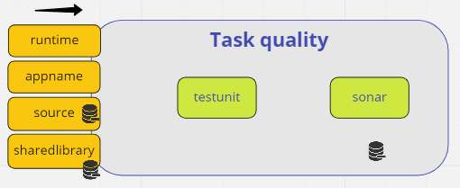

Desenvolvendo as Tasks
================
## Objetivo

Ao final desse módulo você deve ter criados todos as tasks necessárias para o desenvolvimento da pipeline.

## Criando a tasks do Projeto

Para o desenvolvimento do nosso projeto vamos precisar criar 6 `Tasks`:

* `Source`: Essa Task vai ter um `Step`, que basicamente vai fazer o clone do projeto do git;
* `CI-QA` : Essa Task vai ter 2 `steps`:
    * `TestUnit` : Executa o teste unitário;
    * `Sonar`: Executa a cobertura de qualidade do código;
* `CI-Security`: Essa Task vai ter 2 `steps`:
    * `Horusec`: Ferramenta de Sast para verificar a segurança do código;
    * `Trivy`: Ferramenta para analisar a segurança do container;
* `CI-Build`: Essa Task vai ter 3 `steps`:
    * `Build`: Realiza o build da aplicação.
    * `Package`: Faz o empacotamento da aplicação em uma imagem docker, gerando o artefato final;
    * `Publish`: Pública a imagem no dockerhub;
* `Tests`: Essa Task vai ter 2 `steps`:
    * `Performance`: Teste de performance da aplicação utilizando o `K6`.
    * `Integration`: Teste de API com o Karate
* `Deploy`: Essa Task vai ter apenas um `steps` para realização do deploy simples do container no cluster kubernetes.

`


## Ferramentas

* [SonarCloud](https://sonarcloud.io/): Sonar para analise de qualidade. 
* [horusec](https://horusec.io/site/): Ferramanta de SAST para verificação de segurança do código fonte.
* [trivy](https://www.aquasec.com/products/trivy/): Ferramenta de segurança de container.
* [k6](https://k6.io/): Ferramenta de teste de performance.
* [Karate](https://github.com/karatelabs/karate): Ferramenta de teste de integração de API


## Workspace

Para desenvolvimento da pipeline vamos precisar de 3 `workspace`:

`

* app-source: Nesse workspace vai armazenar o código fonte durante a execução;
* sharedlibrary: Nesse workspace vai conter os comandos necessários para execução das tasks;
* cache: Esse workspace vai ser utilizado como cache para armazenar as dependências das aplicações.

Os manifesto dos volumes foram criados no arquivo [proj/pv-workspaces.yaml](proj/pv-workspaces.yaml).

```bash:proj/pv-workspaces.yaml
kubectl apply -f pv-workspaces.yaml
persistentvolumeclaim/app-source created
persistentvolumeclaim/sharedlibrary created
persistentvolumeclaim/cache created
```
## Populando 

## Tasks
O nosso próximo passo vamos criar as `Tasks` necessario para o desenvolvimento da pipeline.


### Criando a Tasks `Source`
Essa Task vai ter um `Step`, que basicamente vai fazer o clone do projeto do git;

`tkn hub install task git-clone`
`kubectl apply -f https://raw.githubusercontent.com/tektoncd/catalog/main/task/git-clone/0.5/git-clone.yaml`

```yaml:proj/Source/taskrun-source.yaml
```
`


#### SharedLibary

A SharedLibary é um repositório que contém os comandos que são executados na pipelines, tornando a solução de pipeline com mais segurança e governança.

A cada alteração no repositório da sharedlibrary no git, é necessário atualizar o `workspace` para a pipelines obter os novos comandos. Para esse controle, o ideal é ter um pipeline apenas para gerenciar a sharedlibrary.

Para esse projeto, vamos criar apenas uma `TaskRun` para atualizar o `workspace`.


https://github.com/clodonil/workshop_tekton_pipelines/blob/task-dev/proj/tasks/Source/taskrun-sharedlibrary.yaml

```yaml:proj/tasks/Source/task-sharedlibrary.yaml

```

Populando a `sharedlibrary`

```bash
kubectl apply -f task-sharedlibrary.yaml
```

### Criando a Takss `CI-QA`
 Essa Task vai ter 2 `steps`:
    * `TestUnit` : Executa o teste unitário;
    * `Sonar`: Executa a cobertura de qualidade do código;

* [SonarCloud](https://sonarcloud.io/): Sonar para analise de qualidade. 

```bash
kubectl create secret generic sonar --from-literal=SONAR_TOKEN='e2fd9312a36a9ec063e6a200e1b9a8a9a2fb5e74'
```    



### Criando a Tasks `CI-Security`
 Essa Task vai ter 2 `steps`:

* [horusec](https://horusec.io/site/): Ferramanta de SAST para verificação de segurança do código fonte.
* [trivy](https://www.aquasec.com/products/trivy/): Ferramenta de segurança de container.


    
### Criando a Tasks `CI-Build`
 Essa Task vai ter 3 `steps`:
    * `Build`: Realiza o build da aplicação.
    * `Package`: Faz o empacotamento da aplicação em uma imagem docker, gerando o artefato final;
    * `Publish`: Pública a imagem no dockerhub;


### Criando a Tasks `Tests`
 Essa Task vai ter 2 `steps`:
    * `Performance`: Teste de performance da aplicação utilizando o `K6`.
    * `Integration`: Teste de API com o Karate

* [k6](https://k6.io/): Ferramenta de teste de performance.
* [Karate](https://github.com/karatelabs/karate): Ferramenta de teste de integração de API

### Criando a Tasks `Deploy`
 Essa Task vai ter apenas um `steps` para realização do deploy simples do container no cluster kubernetes.
