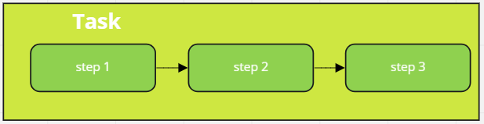
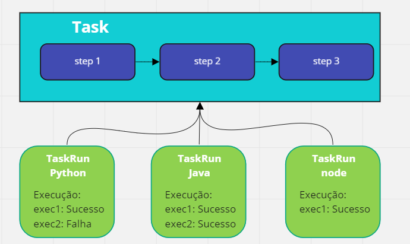
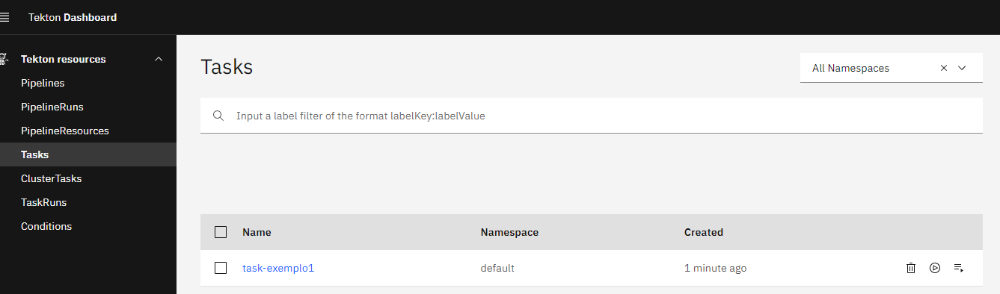
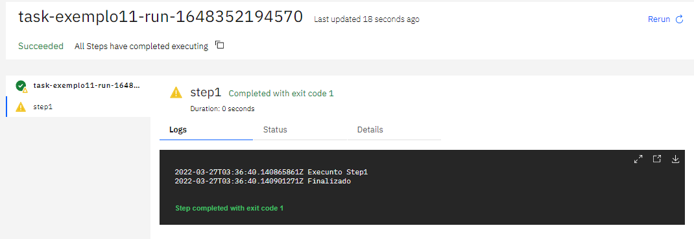

Criando Tasks
================
## Objetivo

Ao final deste modulo você será capaz de:
* Entenda o que é uma Task
* Entenda como clonar um projeto git e compilação usando o Task
* Entenda como funciona os Workspaces
* Crie uma task de build 
* Como executar uma Tasks

## Clone do projeto

Para execução desse módulo, é necessário clonar o repositório do treinamento e configurar a variável de ambiente, caso ainda não tenha feito.

```bash
git clone https://github.com/clodonil/treinamento_tekton_pipelines.git
export TREINAMENTO_HOME="$(pwd)/treinamento_tekton_pipelines"
cd $TREINAMENTO_HOME
```

## Conteúdo:
> 1. Conceito
>   1.1. Task e TaskRun
> 2. Tasks e Step
> 3. Parâmetros
> 4. StepTemplate
> 5. Configurações
> 6. Volumes
> 7. Workspaces
> 8. Sidecars
> 9. Results
> 10. onError

## 1. Conceito 

A `Task` é uma coleção de `Steps` que são organizados em ordem de execução como parte de pipeline de `integração continua`. A `Task` é executado da mesma forma que um pod no cluster do Kubernetes, onde cada `Step` se torna um contêiner em execução do pod.



Os `Steps` são executados sequencialmente conforme foram criados e cada um deles pode conter uma imagem de pod diferente. Basicamente um `step` deve receber uma entrada, processar algo especifico e gerar um saída.

### 1.1. Task e TaskRun
Enquanto as `Task` define um `template` de execução de tarefas e passos, o `TaskRun` é uma execução de uma `Tasks`. O histórico de execução e os logs estão registrados no `TaskRun` para rastreabilidade.



Dessa forma uma `Task` pode ser generica suficiente para executar a mesma tarefa para diferentes linguagens com regras de execução e históricos de execução individualizada para cada `TaskRun`.


## 2. Tasks e Step

Agora que já sabemos o que é `Task`, `Taskrun` e `Steps`, vamos executar o nossa primeira `Task`.
Como primeiro exemplo, vamos criar um `Task` com o nome `task-exemplo1` que contém 3 `Steps`. Nesse exemplo, a `Task` não recebe nenhum parâmetro de entrada e não gera nenhum saída.


```yaml:src/task-exemplo1.yaml
apiVersion: tekton.dev/v1beta1
kind: Task
metadata:
  name: task-exemplo1
spec:
  steps:
    - name: step1
      image: ubuntu      
      script: |
        #!/usr/bin/env bash
        echo "Execunto Step1"
        date
        echo "Finalizado"
    - name: step2
      image: ubuntu      
      script: |
        #!/usr/bin/env bash
        echo "Execunto o Step2"
        echo "Preenchendo o arquivo1" > arquivo1.txt
        ls
        echo "Finalizado"
    - name: step3
      image: ubuntu      
      script: |
        #!/usr/bin/env bash
        echo "Execunto o Step3"
        uname -a
        echo "Finalizado"
```

A criação da `Task` no kubernetes, segue o mesmo padrão da aplicação de qualquer manifesto no cluster.

Conforme realizado abaixo

```bash
kubectl apply -f task-exemplo1.yaml
```
Você pode visualziar a `Task` criada de 2 formas diferentes. 

* Utilizando o comando `tkn`:
```bash
tkn task list
NAME            DESCRIPTION   AGE
task-exemplo1                 6 seconds ago 
```
* Utilizando o dashboard.



Para executar uma `Task` precisamos da criação do manifesto chamado `TaskRun`. O manifesto pode ser criado atráves de um arquivo `yaml` ou criado dinamicamente através do dashboard ou utilizando o cli `tkn`.

```bash
tkn task start task-exemplo1
TaskRun started: task-exemplo1-run-dhcxj

In order to track the TaskRun progress run:
tkn taskrun logs task-exemplo1-run-dhcxj -f -n default
```

A criação do manifesto `yaml` permite você trabalhar nativamente com o `kubernetes`, sem a necessidade de instalação de outras ferramentas como o `tkn`.

Exemplo do manifesto do `taskrun`.

```yaml:src/taskrun-exemplo1.yaml
apiVersion: tekton.dev/v1alpha1
kind: TaskRun
metadata:
  name: taskrun-exemplo1
spec:
  taskRef:
     name: task-exemplo1
```

E para executar utilize o comando do `kubectl`:

```bash
kubectl apply -f taskrun-exemplo1.yaml
taskrun.tekton.dev/taskrun-exemplo1 created
```


## 3. Entradas (Input)


### 3.1  Parâmetros
Para uma `Task`, pode ser especificado parâmetros de entradas, que são utilizados como flags de compilação ou para mudar o comportamento da `Task` conforme o seu valor.

Os nomes dos parâmetros devem ser criados seguindo a seguinte regra:

* Deve conter apenas caracteres alfanuméricos, hifens (-), sublinhados (_) e pontos (.).
* Deve começar com uma letra ou um sublinhado (_).

Além do nome, deve ser definido o `type` do parâmetro que pode ser:
* `array` : Uma lista de argumentos é passado para a `Tasks`;
* `string`: Apenas um argumento é passado para a `Tasks`.

Abaixo temos uma `Tasks` que recebe como entrada 2 parâmetros que são o `build-args` que é um `array` e o `buildImage` que é do tipo `string`.
A ideia é criar uma `Tasks` que funciona como template para passagem de parâmetro para definir a imagem e os comandos que devem ser executados.

```yaml:src/task-exemplo2.yaml
apiVersion: tekton.dev/v1beta1
kind: Task
metadata:
  name: task-exemplo2-params
spec:
  params:
    - name: build-args
      type: array
      description: Build argumentos
    - name: buildImage
      type: string
      description: imagem para build
      default: ubuntu
  steps:
    - name: step1
      image: $(params.buildImage)
      args: ["$(params.build-args[*])"]
```      

Aplique essa `Tasks` utilizando o comando do `kubectl`.

```bash
kubectl apply -f task-exemplo2.yaml
```

Com o template da `Task`criado, vamos criar as `Tasksrun` para executar ações diferentes com a mesma `Tasks`.

Na primeira execução, vamos criar a `TaskRun` de forma declarativa e definir como parâmetro os seguintes valores:

* build-args: ('ls -l /')
* buildImage: centos

Vamos usar a imagem docker do `centos` e executar o comando `ls` dentro do container.


```yaml:src/taskrun-exemplo2.yaml
apiVersion: tekton.dev/v1alpha1
kind: TaskRun
metadata:
  name: taskrun-exemplo2
spec:
  params:
    - name: build-args
      value:
        - 'ls'
        - '- l /'
    - name: buildImage
      value: centos
  taskRef:
     name: task-exemplo2
```
Pode aplicar o `Taskrun` e acompanhar a execução do modelo declarivo e acompanhar a execução.

Na segunda execução, vamos criar a `Taskrun` pelo CLI (tkn) e passar os seguintes valores como parâmetros.

* build-args: -c import sys; print("Ola Mundo"); print(sys.version)
* buildImage: python


```bash
 tkn task  start task-exemplo2 -p buildImage='python' -p build-args='-c','import sys; print("Ola Mundo"); print(sys.version)'
```

Nessa execução, estamos utilizando uma imagem python para mostrar o  "Ola Mundo" e mostrar a versão.

Dessa forma vimos na prática como passar parâmetros para uma `Tasks`.

## 4. StepTemplate
Um recurso muito interessante na `Tasks` para evitar repetição de código é o `StepTemplate`. Dessa forma podemos declarar as funções padrões para todos os `Steps`, evitando assim ficar repetindo código.

Por exemplo, podemos declarar a imagem padrão dos `Steps` e também os recursos de cpu e memória.

```yaml:src/task-exemplo4.yaml
apiVersion: tekton.dev/v1beta1
kind: Task
metadata:
  name: task-exemplo4
spec:
  stepTemplate:
    image: ubuntu  
    securityContext:
      runAsNonRoot: false
      runAsUser: 1001     
    resources:
        requests:
          memory: 128Mi
          cpu: 250m
        limits:
          memory: 512Mi
          cpu: 300m
  steps:
    - name: step1
      script: |
        #!/usr/bin/env bash
        echo "Execunto Step1"
        cat /etc/os-release
        echo "Finalizado"
    - name: step2
      image: centos
      script: |
        #!/usr/bin/env bash
        echo "Execunto o Step2"
        cat /etc/os-release
        echo "Finalizado"
```

Nesse exemplo, todos os `Steps` que não definir uma imagem base, vai utilizar a imagem do `ubuntu`, a mesma coisa para memória e cpu.

## 5. Configurações

Outras configurações importantes para serem utilizadas  na `Tasks`:
* `Timeout` : Definir o tempo máximo de execução do `Step`

Exemplo:
```yaml
  steps:
    - name: build
      timeout: 1h
      image: centos  
      script: |
        #!/usr/bin/env bash
        echo "Execunto o build"
        sleep 120
        cat /etc/os-release
        echo "Finalizado"
```        

*  `Onerror`: Define o que acontece com o `Step`em caso de falha. Por padrão em caso de falha a execução é parada e os `Steps`seguintes não são executados. Para mudar esse comportamento podemos usar o `onerror`;
 > *  `onError: continue` : Em caso de falha, a execução continua e para saber o status da execução é necessário consultar o exit code.
 > *  `onerror: stopAndFail` : Em caso de falha, a execução dos `Steps` seguintes  é interrompida (padrão).
 
## 6. Volumes
Para um `Task` pode ser definido um ou mais `volumes` para manipulação de dados entre os `Steps`.

Por exemplo, podemos usar `volumes` para fazer o seguinte:

* Monte um kubernetes `Secret`;
* Crie um volume `emptyDir` para armazenar cache de dados para multi `Steps`;
* Monte um Kubernetes `ConfigMap`;

No exemplo abaixo, é criado na `Tasks` o volume `emptyDir` para compartilhar dados entre o step1 e o step2.

```yaml:src/task-exemplo5.yaml
apiVersion: tekton.dev/v1beta1
kind: Task
metadata:
  name: task-exemplo5
spec:
  steps:
    - name: step1
      image: centos
      script: |
        #!/usr/bin/env bash
        curl https://www.google.com > /var/my-volume/site1.txt
      volumeMounts:
        - name: my-volume
          mountPath: /var/my-volume
    - name: step2
      image: ubuntu
      script: |
        #!/usr/bin/env bash
        cat /etc/my-volume/site1.txt
        ls -l /etc/my-volume  
      volumeMounts:
        - name: my-volume
          mountPath: /etc/my-volume
  volumes:
    - name: my-volume
      emptyDir: {}
```

## 7. Workspaces
Workspaces permitem especificar um ou mais `volumes` nas Task necessários durante a execução.

Os parâmetros para especificar um Workspace são:

* `name`: Esse campo é requirido, é o nome da Workspace;
* `description`: Descrição do uso da workspacd
* `readOnly`: Um campo `boolean` que define que o Workspace vai ser apenas para leitura (não permite gravar). Por padrão é falso.
* `optional`: Um campo `boolean` que indica que a Taskrun pode omitir a declaração da workspace. Por padrão é falso.
* `mountPath`: É o path a onde o workspace vai estar localizado no disco. Se um path não foi atribuido o padrão é/workspace/<name>.

Como exemplo da utilização do Workspace, vamos criar um volume do tipo `PersistentVolumeClaim` com o tamanho de 1Gi. Aplique essa configuração utilizando o `kubectl apply -f pv-exemplo8.yaml`

```yaml:src/pv-exemplo8.yaml
apiVersion: v1
kind: PersistentVolumeClaim
metadata:
  name: mypvc
spec:
  accessModes:
    - ReadWriteOnce
  resources:
    requests:
      storage: 1Gi
```
Com o volume criado, vamos criar a `Tasks`, que basicamente tem a função de criar arquivos dentro do Workspace.

```yaml:src/task-exemplo8.yaml
apiVersion: tekton.dev/v1beta1
kind: Task
metadata:
  name: task-exemplo8
spec:
  workspaces:
    - name: myworkspace
      optional: true
      description: The folder where we write the message to
      mountPath: /dados
  steps:
    - name: step1
      image: ubuntu
      script: |
        #!/usr/bin/env bash
        touch /dados/file-$(date "+%Y.%m.%d-%H.%M.%S")
        echo "Finalizado"
    - name: step2
      image: ubuntu
      script: |
        #!/usr/bin/env bash
        ls -l /dados
        echo "Finalizado"

```

Para executar a `tasks` é necessário passar o nome do workspace e o volume.

```bash
 tkn task start task-exemplo2 -p buildImage='centos' -p build-args='-c','ls -lha /'
 kubectl apply -f task-exemplo8.yaml
 tkn task start task-exemplo8  -w name=myworkspace,claimName=mypvc
```

## 8. Sidecars
Em uma `Task` é possível especificar o campo de `sidecars`, que basicamente instância um container ao lado dos `steps` que pode fornecer funções auxiliares.
Você pode utilizar o `sidecars` para:
* Utilizar Docker in Docker;
* Executar um servidor de API simulado que seu aplicativo pode acessar durante o testes;

O `Sidecars` é iniciado antes dos `Steps` e excluidos após a conclusão da execução das tasks.

Como exemplo, vamos executar uma image de um servidor web (ex: nginx) no `sidecars`, simulando aplicação, e no `Step` vamos executar o k6 para teste de performance.

```yaml
apiVersion: tekton.dev/v1beta1
kind: Task
metadata:
  name: task-exemplo6
spec:
  params:
     - name: image
       type: string
  steps:
    - name: test-carga
      image: loadimpact/k6
      script: |
        cat <<EOF >>test.js
        import http from 'k6/http';
        import { sleep } from 'k6';
        export default function () {
            http.get('http://localhost');
            sleep(1);
        }
        EOF
        k6 run test.js 
  sidecars:
    - image: $(params.image)
      name: server
```

## 9. Results

Uma `Task` é capaz de emitir resultados em formato de `string` que podem ser visualizados pelos usuários e passados ​​para outras tarefas em um pipeline.
Ao ser declarado um `result`, o path do arquivo é criado automaticamente.
É importante observar que o `Tekton` não realiza nenhum processamento no conteúdo dos `results`, eles são emitidos literalmente de sua `Task`, incluindo quaisquer caracteres de espaço em branco à esquerda ou à direita.

Para exemplificar o uso do `results` vamos utilizar o mesmo exemplo utilizado no `sidecars` e vamos exportar o resultado do report do k6.

```yaml
apiVersion: tekton.dev/v1beta1
kind: Task
metadata:
  name: task-exemplo7
spec:
  params:
     - name: image
       type: string
  results:
     - name: k6-report
       description: Resultado do teste de performance
  steps:
    - name: test-carga
      image: loadimpact/k6
      script: |
        cat <<EOF >>test.js
        import http from 'k6/http';
        import { sleep } from 'k6';
        export default function () {
            http.get('http://localhost');
            sleep(1);
        }
        EOF
        k6 run --out json=test.json --summary-trend-stats="min,avg,med,p(99),p(99.9),max,count" --summary-time-unit=ms test.js 
        grep 'Point' test.json | head -n 1| tee $(results.k6-report.path)

  sidecars:
    - image: $(params.image)
      name: server
```

## 10. onError

Uma `Task` pode finalizar com sucesso ou com falha. No fluxo de uma pipeline, uma `Tasks` com falha determina a paralização de toda a pipeline. Para casos especificos, podemos configurar o `onError` para determinar que mesmo com falha a `Tasks` deve ser finaliaza com sucesso para continuar a execução da pipeline.

Segue o exemplo de configuração do `onError`:

```yaml
apiVersion: tekton.dev/v1beta1
kind: Task
metadata:
  name: task-exemplo1
spec:
  steps:
    - name: step1
      onError: continue
      image: ubuntu      
      script: |
        #!/usr/bin/env bash
        echo "Execunto Step1"
        echo "Finalizado"
```

No Dashboard é possível verificar o status da execução da tasks:

