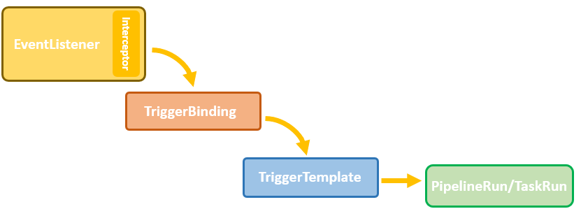
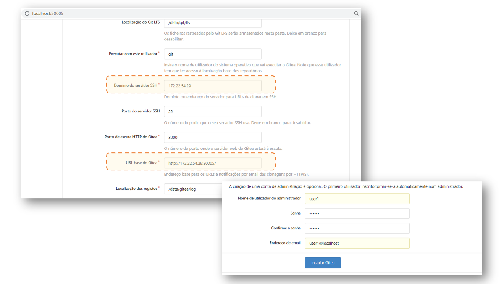
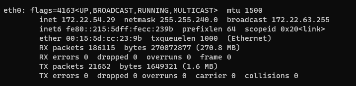
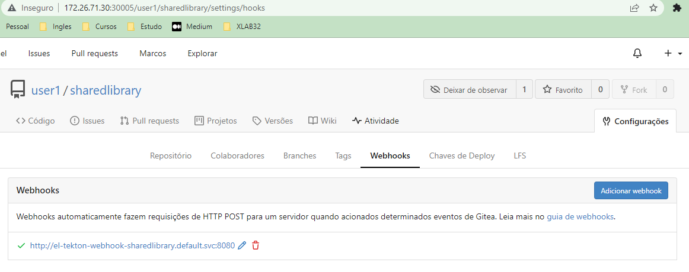
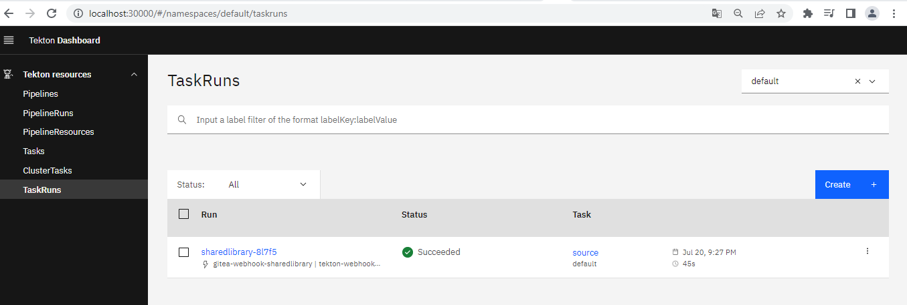
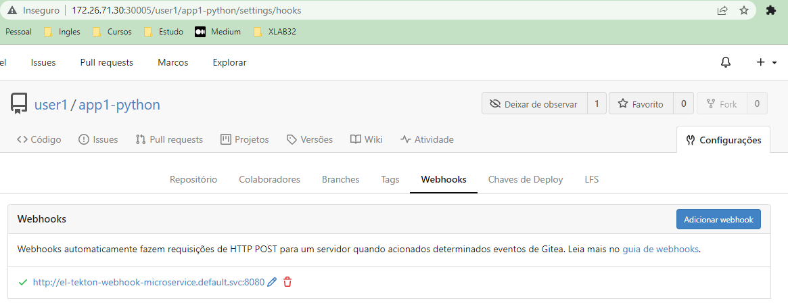
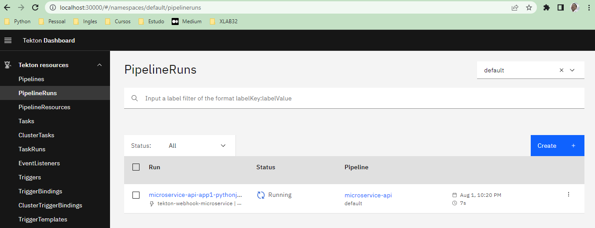

Triggers
================
## Objetivo

Ao final deste modulo você será capaz de:
* Entender como as triggers no tekton funcionam;
* Como criar uma trigger baseado em evento do repositório;

## Setup

Para execução desse módulo, é necessário clonar o repositório do treinamento e configurar a variável de ambiente, caso ainda não tenha feito.

```bash
git clone https://github.com/clodonil/treinamento_tekton_pipelines.git
export TREINAMENTO_HOME="$(pwd)/treinamento_tekton_pipelines"
cd $TREINAMENTO_HOME
```

## Pré-Requisito

Para realizar a criação das triggers é necessário ter as pipelines criadas, portanto realize o módulo [5.1. Desenvolvimento das pipelines](pipeline-dev.md).

## Trigger

As Triggers são componentes do Tekton que permite detectar e extrair informações de eventos de uma variedade de fontes, tais como `repositório git`, `Docker Registry` e `PubSub`. E com essas informações, executar `TasksRun` e `PipelineRun`.

Os Tekton Triggers também podem passar informações extraídas de eventos diretamente para `TaskRuns` e `PipelineRuns`.

A criação da trigger no tekton, envolve a criação dos seguintes componentes:

* EventListener
* Trigger-Bindings
* Trigger-Template

Vamos ver cada um com mais detalhes.

### EventListener
O componente de `EventListener` escuta eventos em uma porta especificada através de um `Pod` em execução. Também é no `EventListener` que são especificada os arquivos de `TriggerBinding` e `TriggerTemplate` que são acionados quandos um evento é detectado.

Quando um evento é detectado, antes de passar para os processos de `TriggerBinding` e `TriggerTemplate` é possível passar pelo `Interceptor` que pode realizar filtros e manipulações no evento.

#### Interceptor
O `Interceptor` é um processador de eventos que fica dentro do `EventListener`.  O `EventListener` recebe o eventos completo e antes de enviar para o `binding` é possível executar filtragem do evento, verificação (usando um segredo), transformação, defina e teste condições de trigger e outros processamentos úteis. 

Depois que os dados do evento passam por um `interceptor`, eles vão para o `TriggerBinding` e `TriggerTemplate`.

### Trigger-Bindings
O `Trigger-Binding` especifica os campos do evento dos quais você deseja extrair dados. Esses dados entram no `TriggerTemplate` como parâmetros dos valores extraídos. 

Você pode então usar os campos preenchidos no `TriggerTemplate` para preencher campos no arquivo associado `TaskRun` ou `PipelineRun`.

### Trigger-Template
O `TriggerTemplate` recebe os parâmetros do `Trigger-Binding` para inicializar os recursos de `TaskRun` ou `PipelineRun`. 

Ele expõe parâmetros que você pode usar em qualquer lugar dentro do modelo do seu recurso.

Abaixo um modelo da estrutura da triggers.




## Instalação do trigger

Agora que sabemos o que são as triggers e os seus componentes, vamos instalar os componentes. E para isso execute os seguintes comandos:

```bash
kubectl apply --filename https://storage.googleapis.com/tekton-releases/triggers/latest/release.yaml
kubectl apply --filename https://storage.googleapis.com/tekton-releases/triggers/latest/interceptors.yaml
```
Aguarde até todos os serviços estarem em `running`, conforme abaixo.

```bash
kubectl get pods --namespace tekton-pipelines 
NAME                                                READY   STATUS    RESTARTS   AGE
tekton-dashboard-57cf45447c-fmcgw                   1/1     Running   0          3h33m
tekton-pipelines-controller-5cfb9b8cfc-ppg4r        1/1     Running   0          3h33m
tekton-pipelines-webhook-6c9d4d5798-4jfl8           1/1     Running   0          3h33m
tekton-triggers-controller-668df9f855-vpgjc         1/1     Running   0          46s
tekton-triggers-core-interceptors-55d8cfbd6-dq775   1/1     Running   0          44s
tekton-triggers-webhook-55574b569b-nscvl            1/1     Running   0          46s
```

## Instalando o gitea

Nesse módulo vamos utilizar os eventos de origem como sendo um repositório do git. E para isso vamos utilizar o `gitea` que um repositório leve com as funcionalidades que precisamos.

Entretanto, todos os conceitos e funcionamento funcionam para qualquer outro repositório de git.

Vamos instalar o `gitea` dentro do `namespace` tools, e para isso é necessário criar, conforme o comando abaixo.  

Os arquivo para instalar o `gitea` no kubernetes são:

* [deployment.yaml](./proj/trigger/gitea/deployment.yaml): Utilizado para definir a imagem do `gitea` e os parâmetros de inicialização;
* [service.yaml](./proj/trigger/gitea/service.yaml): Utilizado para criar o service do `gitea`

O comando de `kubectl` abaixo aplica os 2 arquivos que estão no diretório do `gitea`.

```bash
kubectl create namespace tools
kubectl -n tools apply -f $TREINAMENTO_HOME/proj/trigger/gitea/
```

Aguarde até o serviço ficar no status de `running`.

```bash
kubectl get pods -n tools
NAME                     READY   STATUS    RESTARTS   AGE
gitea-8554476b8b-mm6gc   1/1     Running   0          27s
```

Agora você pode acessar o `gitea` na url: http://localhost:30005/.

Ao acessar o `gitea` pela primeira vez, é necessário configurar. Abaixo temos as principais configurações que são:

* Dominio do servicoe SSH: Nesse campo é necessário especificar o endereço IP da interface de rede. Não utilize o `localhost`.
* Url base do gitea: Nesse campo é necessário informar a URL de acesso. É basicamente composto do endereço IP da interface de rede e a porta 30005 definido no `kind`.
* Dados do administrador: Nome e senha do usuário administrador do gitea



Se estiver utilizando o `Linux`, para saber qual é o número IP da interface de rede, utilize o comando `ip address show`.



## Criar os repositórios e WebHook

Crie as variáveis de ambiente com o usuário e senha criado no `gitea` e o endereço de acesso.

```bash
export USER='XXXX'
export PASS='XXXX'
export GIT='http://xxx.xxx.xxx.xxx:30005'
```
Agora podemos criar os repositórios que utilizaremos para configurar a trigger. A criação dos repositórios podem ser realizados pela `interface web`, entretanto criamos o `script` abaixo para facilitar a utilização.   

Segue os parâmetros utilizados no `gitea_cli.py`:
* `-n`: Cria um novo repositório
* `-r`: Especifica o nome do repositório
* `-u`: Usuário utilizado para fazer o login no `gitea`
* `-p`: Senha do usuário do `gitea`

```bash
python3 $TREINAMENTO_HOME/proj/trigger/gitea/gitea_cli.py -n -r sharedlibrary -u $USER -p $PASS
python3 $TREINAMENTO_HOME/proj/trigger/gitea/gitea_cli.py -n -r app1-python -u $USER -p $PASS
```

## Inicializando o repositório 

Com o respositórios criados, vamos popular com códigos de exemplos.

### SharedLibrary


```bash
cd $TREINAMENTO_HOME/src/sharedlibrary
git init
git add *
git commit -m "first commit"
git remote add origin $GIT/user1/sharedlibrary.git
git push -u origin master
```

### Aplicação

```bash
cd $TREINAMENTO_HOME/src/app1-hello-python
git init
git add *
git commit -m "first commit"
git remote add origin $GIT/user1/app1-python.git
git push -u origin master
```

## Create ServiceAccount, Roles and Role Bindings

```bash
kubectl apply -f $TREINAMENTO_HOME/proj/trigger/rbac.yaml
```

## SharedLibrary


```yaml
apiVersion: triggers.tekton.dev/v1alpha1
kind: EventListener
metadata:
  name: tekton-webhook-sharedlibrary
spec:
  serviceAccountName: tekton-triggers-sa
  triggers:
    - name: tekton-webhook-sharedlibrary
      bindings:
        - ref: tekton-triggerbinding-sharedlibrary
      template:
        ref: tekton-triggertemplate-sharedlibrary
```

```bash
kubectl apply -f $TREINAMENTO_HOME/proj/trigger/sharedlibrary/EventListener.yaml
```

```yaml
apiVersion: triggers.tekton.dev/v1alpha1
kind: TriggerBinding
metadata:
  name: tekton-triggerbinding-sharedlibrary
spec:
  params:
    - name: revision
      value: $(body.repository.default_branch)
    - name: repository
      value: $(body.repository.clone_url)
```

```bash
kubectl apply -f $TREINAMENTO_HOME/proj/trigger/sharedlibrary/trigger-bindings.yaml
```

```yaml
---
apiVersion: triggers.tekton.dev/v1alpha1
kind: TriggerTemplate
metadata:
  name: tekton-triggertemplate-sharedlibrary
spec:
  params:
    - name: revision
      description: The git revision
      default: master
    - name: repository
      description: The git repository url
  resourcetemplates:
    - apiVersion: tekton.dev/v1beta1
      kind: TaskRun
      metadata:
        generateName: 'sharedlibrary-'
        labels:
          tekton.dev/task: 'source'
      spec:
        serviceAccountName: tekton-triggers-sa
        taskRef:
          name: source
        params:
          - name: revision
            value: '$(tt.params.revision)'
          - name: url
            value: '$(tt.params.repository)'
        workspaces:
          - name: output
            persistentVolumeClaim:
               claimName: sharedlibrary

```

```bash
kubectl apply -f $TREINAMENTO_HOME/proj/trigger/sharedlibrary/trigger-template.yaml
```

```bash
kubectl get pods,svc
NAME                                                   READY   STATUS    RESTARTS   AGE
pod/el-tekton-webhook-sharedlibrary-7c57fcf9f8-779hr   1/1     Running   0          13s

NAME                                      TYPE        CLUSTER-IP     EXTERNAL-IP   PORT(S)             AGE
service/el-tekton-webhook-sharedlibrary   ClusterIP   10.96.25.243   <none>        8080/TCP,9000/TCP   13s
```

## Criação do webhook.

```bash
python3 $TREINAMENTO_HOME/proj/trigger/gitea/gitea_cli.py -w el-tekton-webhook-sharedlibrary -r sharedlibrary -u $USER -p $PASS
```






## Pipelinede Microservice

```bash
kubectl apply -f $TREINAMENTO_HOME/proj/trigger/pipeline-microservice/EventListener.yaml
kubectl apply -f $TREINAMENTO_HOME/proj/trigger/pipeline-microservice/trigger-bindings.yaml
kubectl apply -f $TREINAMENTO_HOME/proj/trigger/pipeline-microservice/trigger-template.yaml
```

```bash
kubectl get pods,svc
NAME                                                   READY   STATUS      RESTARTS   AGE
pod/el-tekton-webhook-microservice-67bf667f45-vvxjp    1/1     Running     0          14s
pod/el-tekton-webhook-sharedlibrary-7c57fcf9f8-779hr   1/1     Running     0          4m6s

NAME                                      TYPE        CLUSTER-IP     EXTERNAL-IP   PORT(S)             AGE
service/el-tekton-webhook-microservice    ClusterIP   10.96.127.93   <none>        8080/TCP,9000/TCP   14s
service/el-tekton-webhook-sharedlibrary   ClusterIP   10.96.25.243   <none>        8080/TCP,9000/TCP   4m6s
service/kubernetes                        ClusterIP   10.96.0.1      <none>        443/TCP             69m
```

### Criação do webhook.
```bash
python3 $TREINAMENTO_HOME/proj/trigger/gitea/gitea_cli.py -w el-tekton-webhook-microservice -r app1-python -u $USER -p $PASS
```






```json
{
  "ref": "refs/heads/master",
  "before": "a4bfa24015149e24d501b6f99229d49ab121f629",
  "after": "a4bfa24015149e24d501b6f99229d49ab121f629",
  "compare_url": "",
  "commits": [
    {
      "id": "a4bfa24015149e24d501b6f99229d49ab121f629",
      "message": "first commit\n",
      "url": "http://localhost:3000/user1/app1/commit/a4bfa24015149e24d501b6f99229d49ab121f629",
      "author": {
        "name": "Clodonil Trigo",
        "email": "clodonil@nisled.org",
        "username": ""
      },
      "committer": {
        "name": "Clodonil Trigo",
        "email": "clodonil@nisled.org",
        "username": ""
      },
      "verification": null,
      "timestamp": "0001-01-01T00:00:00Z",
      "added": null,
      "removed": null,
      "modified": null
    }
  ],
  "head_commit": {
    "id": "a4bfa24015149e24d501b6f99229d49ab121f629",
    "message": "first commit\n",
    "url": "http://localhost:3000/user1/app1/commit/a4bfa24015149e24d501b6f99229d49ab121f629",
    "author": {
      "name": "Clodonil Trigo",
      "email": "clodonil@nisled.org",
      "username": ""
    },
    "committer": {
      "name": "Clodonil Trigo",
      "email": "clodonil@nisled.org",
      "username": ""
    },
    "verification": null,
    "timestamp": "0001-01-01T00:00:00Z",
    "added": null,
    "removed": null,
    "modified": null
  },
  "repository": {
    "id": 1,
    "owner": {"id":1,"login":"user1","full_name":"","email":"user1@localhost","avatar_url":"http://localhost:3000/user/avatar/user1/-1","language":"","is_admin":false,"last_login":"0001-01-01T00:00:00Z","created":"2022-06-21T00:43:25Z","restricted":false,"active":false,"prohibit_login":false,"location":"","website":"","description":"","visibility":"public","followers_count":0,"following_count":0,"starred_repos_count":0,"username":"user1"},
    "name": "app1",
    "full_name": "user1/app1",
    "description": "",
    "empty": false,
    "private": false,
    "fork": false,
    "template": false,
    "parent": null,
    "mirror": false,
    "size": 20,
    "html_url": "http://localhost:3000/user1/app1",
    "ssh_url": "git@localhost:user1/app1.git",
    "clone_url": "http://localhost:3000/user1/app1.git",
    "original_url": "",
    "website": "",
    "stars_count": 0,
    "forks_count": 0,
    "watchers_count": 1,
    "open_issues_count": 0,
    "open_pr_counter": 0,
    "release_counter": 0,
    "default_branch": "master",
    "archived": false,
    "created_at": "2022-06-21T00:44:00Z",
    "updated_at": "2022-06-21T00:46:14Z",
    "permissions": {
      "admin": false,
      "push": false,
      "pull": false
    },
    "has_issues": true,
    "internal_tracker": {
      "enable_time_tracker": true,
      "allow_only_contributors_to_track_time": true,
      "enable_issue_dependencies": true
    },
    "has_wiki": true,
    "has_pull_requests": true,
    "has_projects": true,
    "ignore_whitespace_conflicts": false,
    "allow_merge_commits": true,
    "allow_rebase": true,
    "allow_rebase_explicit": true,
    "allow_squash_merge": true,
    "default_merge_style": "merge",
    "avatar_url": "",
    "internal": false,
    "mirror_interval": ""
  },
  "pusher": {"id":1,"login":"user1","full_name":"","email":"user1@localhost","avatar_url":"http://localhost:3000/user/avatar/user1/-1","language":"","is_admin":false,"last_login":"0001-01-01T00:00:00Z","created":"2022-06-21T00:43:25Z","restricted":false,"active":false,"prohibit_login":false,"location":"","website":"","description":"","visibility":"public","followers_count":0,"following_count":0,"starred_repos_count":0,"username":"user1"},
  "sender": {"id":1,"login":"user1","full_name":"","email":"user1@localhost","avatar_url":"http://localhost:3000/user/avatar/user1/-1","language":"","is_admin":false,"last_login":"0001-01-01T00:00:00Z","created":"2022-06-21T00:43:25Z","restricted":false,"active":false,"prohibit_login":false,"location":"","website":"","description":"","visibility":"public","followers_count":0,"following_count":0,"starred_repos_count":0,"username":"user1"}
}
```